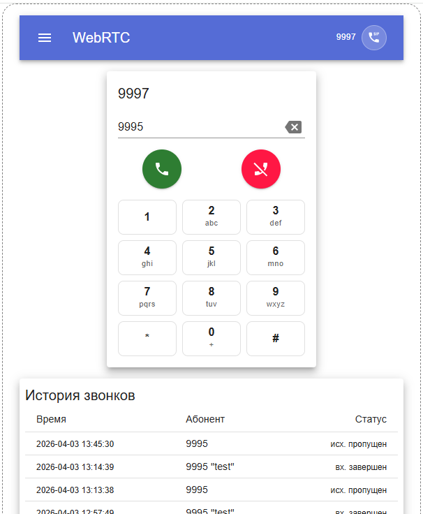
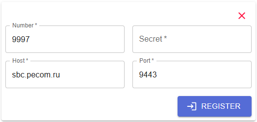
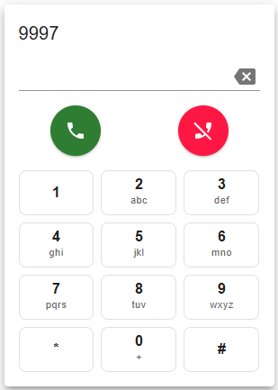
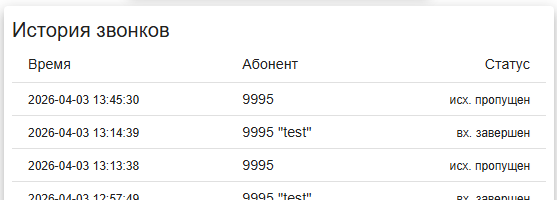
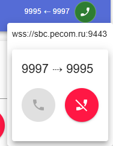

# sipjs-react
WebRTC телефон на базе библиотеки [sipjs](https://sipjs.com/)



Готовая сборка в [phone/dist](phone/dist)

```bash
cd phone
npm install
# npm run dev
npm run build
```


# Компоненты

## PhoneReg.jsx


## PhonePad.jsx


## PhoneHistory.jsx


## PhoneControlIco.jsx



# Пакеты
Использую Node.js + Vite, см. [tools](tools)

```bash
npm install --save react react-dom
npm install --save react-redux redux redux-logger redux-thunk
npm install --save @mui/material @emotion/react @emotion/styled @mui/icons-material
npm install --save sip.js date-fns
npm install --save-dev vite @vitejs/plugin-react

# Перепрыгнуть за мажорные версии
npx npm-check-updates
```
