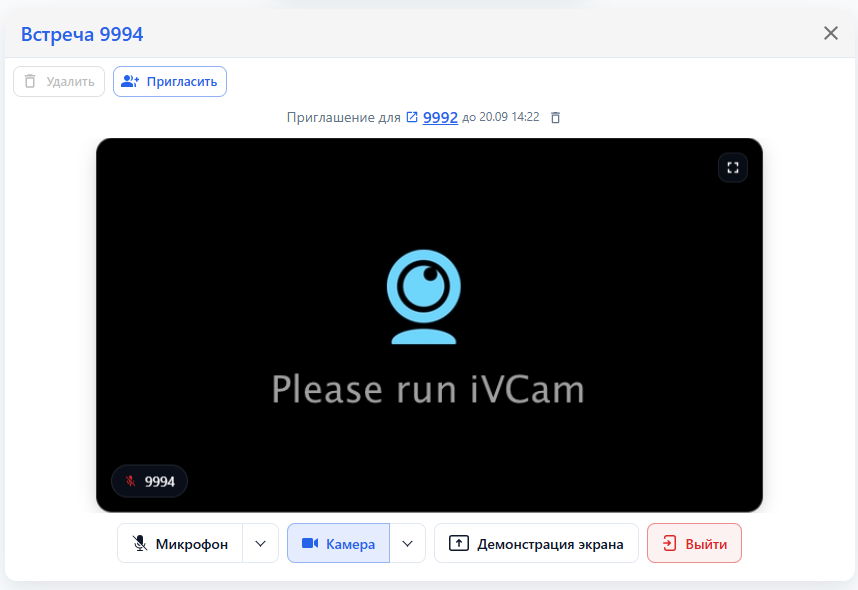
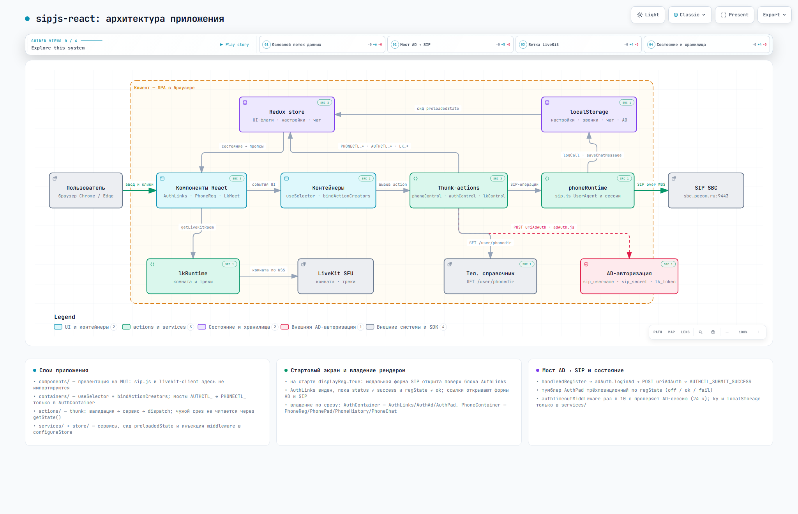
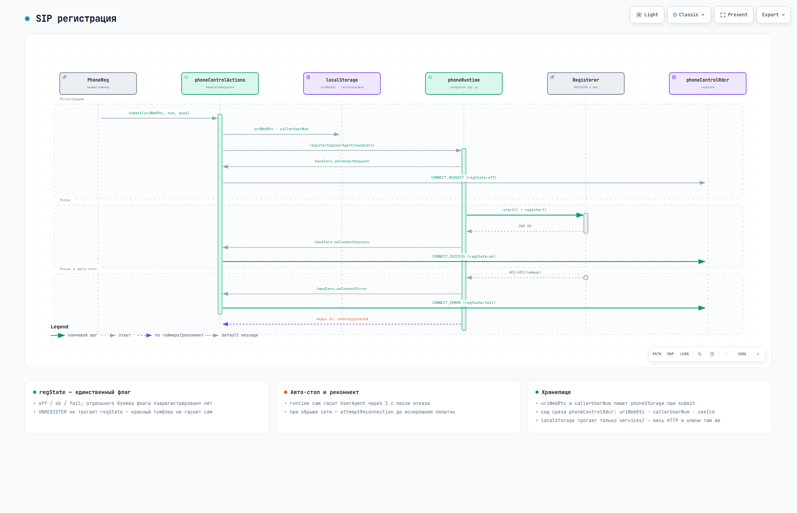
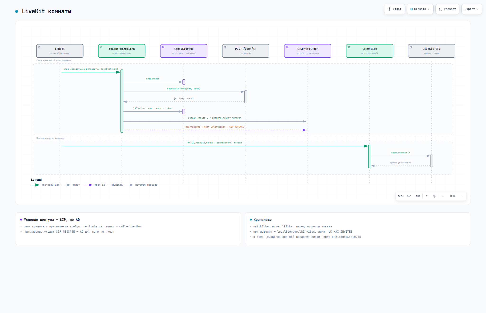

# sipjs-react

WebRTC-телефон: SIP-клиент на [sip.js](https://sipjs.com/), видеовстречи на [LiveKit](https://livekit.io/) и авторизация через Active Directory (внешний AD-API).


Сборка — `npm run build` в `dist/` (каталог в git не хранится).

## Быстрый старт

Требуется Node.js 24.

```bash
npm install
npm run dev     # Vite dev-сервер: http://localhost:3000 (host 0.0.0.0)
npm run build   # сборка в dist
npm run serve   # предпросмотр сборки: http://localhost:4173 (vite preview, host 0.0.0.0)
```

Проверки и форматирование — Biome (`format` и `check` пишут правки в файлы):

```bash
npm run lint    # только проверка
npm run format  # форматирование с записью
npm run check   # линт + форматирование с записью
```

В dev-режиме Vite поднимает мок-API.

## Инструменты (не нужны для запуска приложения)

Работал в **WSL Ubuntu** под Node.js 24:

### Для взаимодействия с UI

[Mermaid CLI](https://github.com/mermaid-js/mermaid-cli#installation) (`mmdc`) проверяет и
рендерит Mermaid; его Puppeteer-браузер **отдельный** от Chromium Playwright.

[Playwright CLI](https://github.com/microsoft/playwright-cli#installation) для UI-проверок
запускать через `.dsh/bin/browser` по навыку `ui-verify`: обёртка задаёт профиль и кэш браузера.

[Archify для DSH](https://github.com/tt-a1i/archify/blob/main/integrations/deepseek-harness/README.md#install)
ставится в профиль `web` (не через глобальный npm); для визуальной проверки ему нужен
Linux-Chromium — порядок в навыке `archify-visual-check`.

```bash
npm install -g @mermaid-js/mermaid-cli @playwright/cli
playwright-cli install-browser chromium
dsh plugin --profile web add @tt-a1i/archify-dsh@0.1.0

#Проверить установку:
mmdc --version
playwright-cli --version
node "$HOME/.dsh/profiles/web/node_modules/@tt-a1i/archify-dsh/skills/archify/bin/archify.mjs" doctor
```

### Плагины совместимости DSH с WSL

Мост между ОС и WSL ставится набором [dsh-wsl-kit](https://github.com/173787247/dsh-wsl-kit) в профиль
`web` (не через глобальный npm). Рекомендуемый минимум — набор `daily`:

```bash
# Скрипт вызывает `dsh plugin --profile web add` для каждого плагина:
curl -fsSL https://raw.githubusercontent.com/173787247/dsh-wsl-kit/master/install.sh \
  | KIT_SET=daily bash

# Отдельный плагин:
dsh plugin --profile web add github:173787247/dsh-wsl-net

# Проверить установку (список плагинов профиля):
node -e "console.log(require(process.env.HOME + '/.dsh/profiles/web/package.json').dsh.profile.bundles)"
```

После установки перезапустить `dsh web`

# Компоненты

Презентационные компоненты (`src/components/`) получают данные и `*Actions` пропсами; со стором их
связывают контейнеры (`src/containers/`): `PhoneContainer`, `AuthContainer`, `LkContainer`,
`MenuAppContainer`. Группы ниже — по срезам store.

## Каркас

### MenuAppBar.jsx
Меню и шапка приложения: пункты «SIP …» (`phoneControlRdcr`), «AD …» (`authControlRdcr`),
«LiveKit Встреча» (`lkControlRdcr`); в шапке — индикаторы `PhoneIco` и `AuthIco`, в drawer —
панели `PhoneDir`, `PhonePad`, `AuthAdInfo`.

## Срез PHONECTL_

### PhoneReg.jsx
Модальная форма SIP-регистрации: user/secret.

### PhonePad.jsx
Рабочая панель «SIP Телефон». Кнопка LiveKit подсвечивается по `lkControlRdcr.displayControl`.

### PhoneHistory.jsx
Журнал «SIP Звонки» из `localStorage.sipCalls`.

### PhoneChat.jsx
Чат по SIP MESSAGE (`localStorage.sipMessages`). Ссылка-приглашение в комнату (`lk_room`).

### PhoneIco.jsx
Индикатор SIP-статуса и системные уведомления о входящем звонке (`phoneNotifications`).

### PhoneDir.jsx
Справочник: поиск по `GET uriPhoneDir`. Ожидаемый ответ:

```json
[
  { "label": "Москва префикс", "prefix": "1999" },
  { "label": "Спб префикс", "prefix": "1923" },
  { "label": "Пользователь с длинным именем каким-то", "num": "9991", "email": "user@example.com" },
  { "label": "Пользователь без почты", "num": "9992" }
]
```


## Срез AUTHCTL_

### AuthLinks.jsx
Стартовый экран «Войти»: пока нет ни AD-сессии, ни SIP-регистрации.

### AuthAd.jsx
Модальная форма AD-входа: `POST` на `uriAdAuth`, ожидаемый ответ:

```json
{
  "sip_username"  : "1234",
  "sip_secret"    : "SECRET",
  "ad_login"      : "login",
  "ad_cn"         : "ФИО",
  "ad_title"      : "Должность",
  "ad_department" : "Отдел"
}
```

### AuthIco.jsx
Индикатор Auth-статуса.

### AuthAdInfo.jsx
Сведения об Auth-сессии.

### AuthPad.jsx
Панель «Мост к сервисам».

## Срез LK_

### LkMeet.jsx
Видеовстреча на [LiveKit](https://livekit.io/) (локальный деплой — [openvidu-local-deployment](https://github.com/OpenVidu/openvidu-local-deployment)).



### LkToken.jsx
Компактная форма приглашения («Вн. номер» + отправка).

### LkThemeStyles.js
Не компонент, а стили: CSS-переменные `@livekit/components-styles` из палитры MUI (`getLiveKitMuiStyles(theme)`).


# Документация

[](https://ars-anosov.github.io/sipjs-react/archify/sipjs-react-architecture.html)

[](https://ars-anosov.github.io/sipjs-react/archify/sipjs-react-sip-store.html)

[](https://ars-anosov.github.io/sipjs-react/archify/sipjs-react-livekit-store.html)


Все документы: <https://ars-anosov.github.io/sipjs-react/>

## Генерация archify-документации

HTML-схемы в `docs/archify/` собираются навыком `archify` (плагин профиля `web`, установка выше).

Команды выполнять из корня репозитория; CLI берётся из профиля `web`:

```bash
ARCHIFY="$HOME/.dsh/profiles/web/node_modules/@tt-a1i/archify-dsh/skills/archify/bin/archify.mjs"

# 1. Проверка спецификации: приёмка — 9/9 проверок, 0 ошибок и 0 предупреждений
node "$ARCHIFY" validate architecture docs/archify/sipjs-react-architecture.architecture.json \
  --quality showcase --repo-root . --json

# 2. Сборка: deliver — единственная пишущая команда, печатает SHA-256 и размеры
node "$ARCHIFY" deliver architecture docs/archify/sipjs-react-architecture.architecture.json \
  docs/archify/sipjs-react-architecture.html --quality showcase --repo-root . --json

# 3. Визуальный контроль по навыку archify-visual-check
node "$ARCHIFY" visual-check docs/archify/sipjs-react-architecture.html --json
```

Для sequence-схем:
- меняем `validate sequence`
- не нужен `--repo-root .` 

При пересборке обновлять и `meta.repository.revision`, иначе ссылки evidence в HTML ведут на старый коммит.

# Пакеты

Зависимости — в `package.json`, установка — `npm install`. Обновление мажорных версий:

```bash
npx npm-check-updates
```

# Лицензия

MIT, см. [LICENSE](LICENSE).
