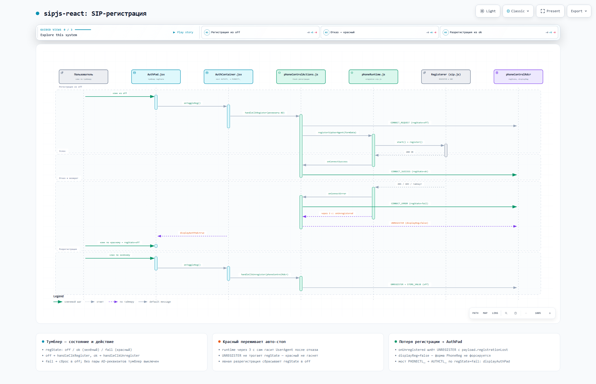

# sipjs-react

WebRTC-телефон: SIP-клиент на [sip.js](https://sipjs.com/), видеовстречи на [LiveKit](https://livekit.io/) и авторизация через Active Directory (внешний AD-API).


Сборка — `npm run build` в `dist/` (каталог в git не хранится).

## Быстрый старт

Требуется Node.js 24.

```bash
npm install
npm run dev     # Vite dev-сервер: http://localhost:3000 (host 0.0.0.0)
npm run build   # сборка в dist
npm run serve   # предпросмотр сборки: http://localhost:4173 (vite preview, host 0.0.0.0)
```

Проверки и форматирование — Biome (`format` и `check` пишут правки в файлы):

```bash
npm run lint    # только проверка
npm run format  # форматирование с записью
npm run check   # линт + форматирование с записью
```

В dev-режиме Vite поднимает мок-API.

## Инструменты для UI в WSL (не нужны для запуска приложения)

Работал в **WSL Ubuntu** под Node.js 24:

```bash
npm install -g @mermaid-js/mermaid-cli @playwright/cli
playwright-cli install-browser chromium
dsh plugin --profile web add @tt-a1i/archify-dsh@0.1.0
```

Проверить установку:

```bash
mmdc --version
playwright-cli --version
node "$HOME/.dsh/profiles/web/node_modules/@tt-a1i/archify-dsh/skills/archify/bin/archify.mjs" doctor
```

[Mermaid CLI](https://github.com/mermaid-js/mermaid-cli#installation) (`mmdc`) проверяет и
рендерит Mermaid; его Puppeteer-браузер **отдельный** от Chromium Playwright.

[Playwright CLI](https://github.com/microsoft/playwright-cli#installation) для UI-проверок
запускать через `.dsh/bin/browser` по навыку `ui-verify`: обёртка задаёт профиль и кэш браузера.

[Archify для DSH](https://github.com/tt-a1i/archify/blob/main/integrations/deepseek-harness/README.md#install)
ставится **в профиль `web`**, а не через глобальный npm; для визуальной проверки ему нужен
Linux-Chromium — порядок в навыке `archify-visual-check`.

## Плагины совместимости DSH с WSL (не нужны для запуска приложения)

Агент и инструменты работают в WSL Ubuntu, поэтому мост
между ОС ставится набором [dsh-wsl-kit](https://github.com/173787247/dsh-wsl-kit) в профиль
`web` (не через глобальный npm). Рекомендуемый минимум — набор `daily`:

```bash
# Скрипт вызывает `dsh plugin --profile web add` для каждого плагина:
curl -fsSL https://raw.githubusercontent.com/173787247/dsh-wsl-kit/master/install.sh \
  | KIT_SET=daily bash

# Отдельный плагин:
dsh plugin --profile web add github:173787247/dsh-wsl-net

# Проверить установку (список плагинов профиля):
node -e "console.log(require(process.env.HOME + '/.dsh/profiles/web/package.json').dsh.profile.bundles)"
```

После установки перезапустить `dsh web`

# Компоненты

Презентационные компоненты (`src/components/`) получают данные и `*Actions` пропсами; со стором их связывают контейнеры (`src/containers/`): `PhoneContainer`, `AuthContainer`, `LkContainer`, `MenuAppContainer`.

## MenuAppBar.jsx
Меню приложения: пункты «SIP …» (`phoneControlRdcr`), «AD …» (`authControlRdcr`), «LiveKit Встреча» (`lkControlRdcr`).

## PhoneReg.jsx


## PhonePad.jsx


## PhoneHistory.jsx


## PhoneIco.jsx


## PhoneChat.jsx
Чат по SIP MESSAGE; ссылка-приглашение в комнату (параметр `lk_room`) выделена акцентом: в исходящем сообщении открывается в новом окне, во входящем — переход тут же (react-router, текущая вкладка); остальные ссылки — как обычно. Отправка — Enter (Shift+Enter/Ctrl+Enter — перенос строки), поле «Вн.номер» следует за собеседником последней отправки (крестик в поле показывает все сообщения).

# Доп. компоненты
Плюшки для интеграции с внешними сервисами

## AuthAd.jsx
POST-запрос к серверу авторизации, ожидаемый ответ:
```json
{
  "sip_username"  : "1234",
  "sip_secret"    : "SECRET",
  "ad_login"      : "login",
  "ad_cn"         : "ФИО",
  "ad_title"      : "Должность",
  "ad_department" : "Отдел"
}
```

Токен LiveKit в этом ответе не приходит: его выдаёт отдельный `POST` на `uriLkToken` (в dev — мок
`/user/lk`), см. `LkMeet.jsx`.


## AuthIco.jsx + AuthAdInfo.jsx
Индикация данных AD-сессии в интерфейсе.

## AuthPad.jsx
Панель «Мост к сервисам»: тумблер SIP-регистрации; встреча LiveKit открывается пунктом меню «LiveKit Встреча» (или сама по ссылке-приглашению).

## PhoneDir.jsx
GET-запрос к серверу справочнику, ожидаемый ответ:
```json
[
  { "label": "Москва префикс", "prefix": "1999" },
  { "label": "Спб префикс", "prefix": "1923" },
  { "label": "Пользователь с длинным именем каким-то", "num": "9991", "email": "user@example.com" },
  { "label": "Пользователь без почты", "num": "9992" }
]
```


## LkMeet.jsx
Видеовстреча на [LiveKit](https://livekit.io/) (локальный деплой — [openvidu-local-deployment](https://github.com/OpenVidu/openvidu-local-deployment)); комната из query `lk_room`/`lk_token`. Свою комнату и ссылку-приглашение выдаёт `POST` на `uriLkToken` (в dev — мок `/user/lk`). Ссылка-приглашение в панели оформлена так же, как в чате, и подписана сроком действия токена (`exp` из JWT, время или дата со временем). Приглашений может быть несколько: панель показывает их списком, хранит в `localStorage` (ключ `lkInvites`, одно актуальное приглашение на номер) и позволяет убрать строку крестиком.


# Документация

[](https://ars-anosov.github.io/sipjs-react/archify/sipjs-react-architecture.html)

[](https://ars-anosov.github.io/sipjs-react/archify/sipjs-react-sip-registration.html)


Все документы: <https://ars-anosov.github.io/sipjs-react/>

# Пакеты

Зависимости — в `package.json`, установка — `npm install`. Обновление мажорных версий:

```bash
npx npm-check-updates
```

# Лицензия

MIT, см. [LICENSE](LICENSE).
