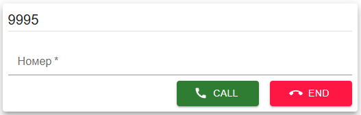
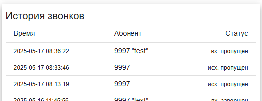

# sipjs-react
WebRTC телефон на базе библиотеки [sipjs](https://sipjs.com/)


# phone
Готовая сборка в [phone/dist](phone/dist)

```powershell
cd phone
npm install
npm run dev
```

## phoneReg.jsx


## PhonePad.jsx


## PhoneHistory.jsx


## PhoneControlIco.jsx


## PhoneControl.jsx


## package.json
Обновиться

```powershell
npm install --save react react-dom
npm install --save react-redux redux redux-logger redux-thunk
npm install --save @mui/material @emotion/react @emotion/styled @mui/icons-material
npm install --save sip.js
npm install --save-dev vite @vitejs/plugin-react
```

## tools
Использую Node.js + Vite, см. [tools](tools)