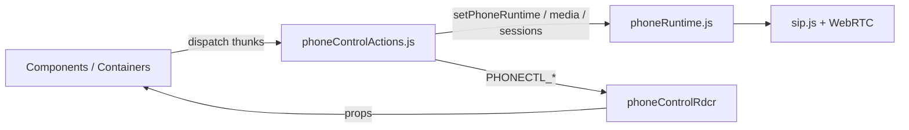
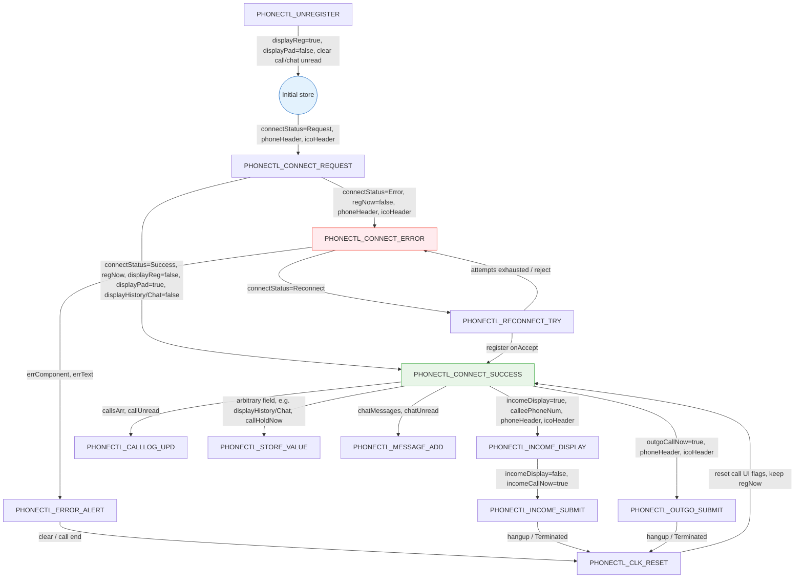
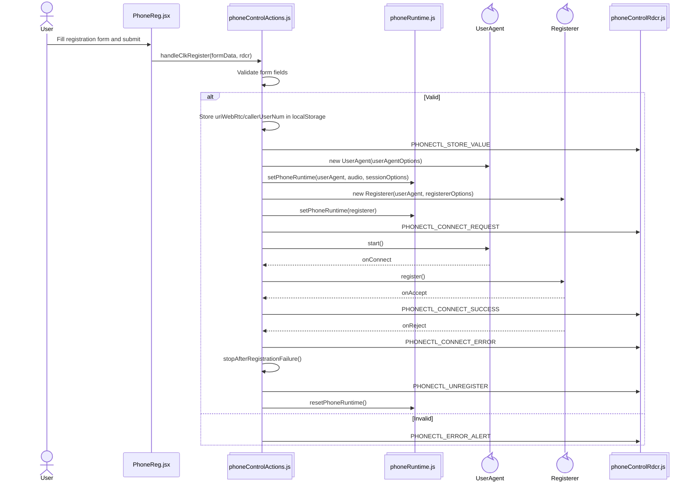
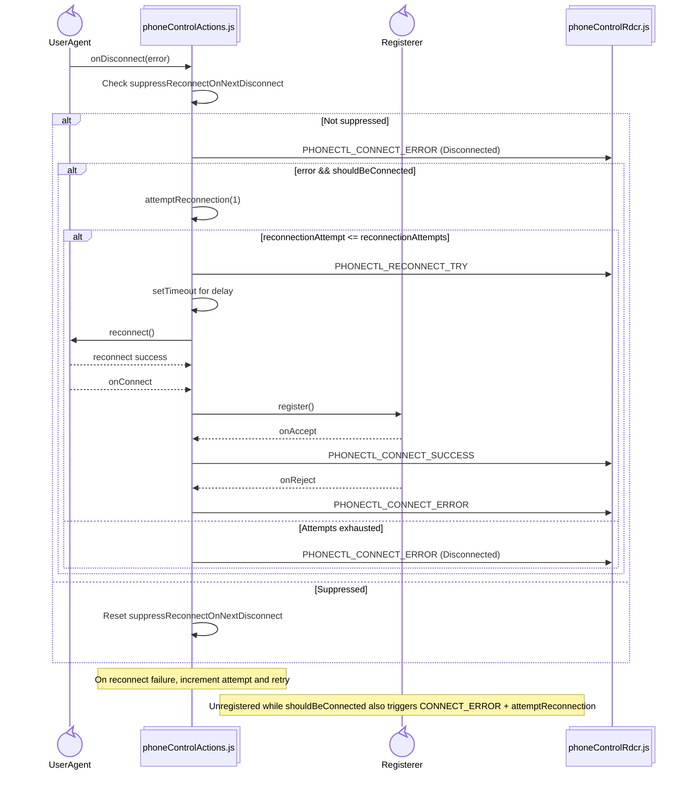
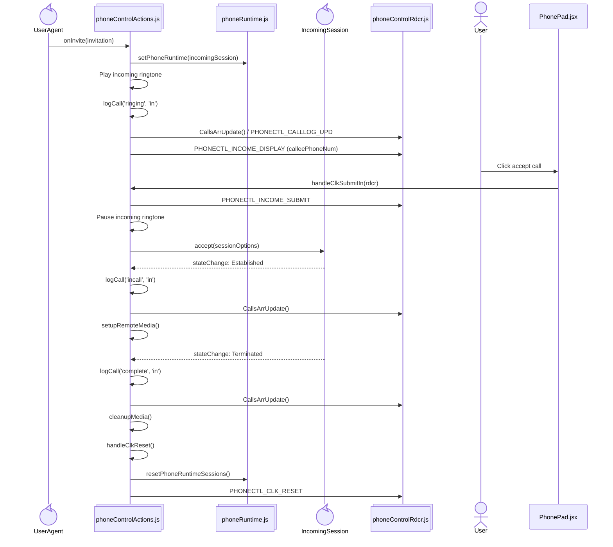
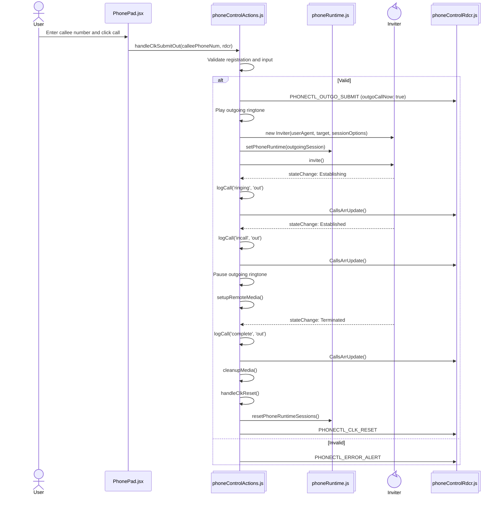

# phone
Готовая сборка в [dist](dist).

## Архитектура состояния

SIP/WebRTC-объекты живут вне Redux — в модуле `phoneRuntime.js`. В store только UI-флаги, заголовки, лог звонков и чат.

`phoneRuntime`: `userAgent`, `registerer`, `sessionOptions`, `incomingSession` / `outgoingSession`, audio elements, `remoteStream`.

## Состояние Redux store (`phoneControlRdcr`)

## SIP регистрация

## Восстановление сетевого обрыва / перерегистрация

## Входящий звонок

## Исходящий звонок

