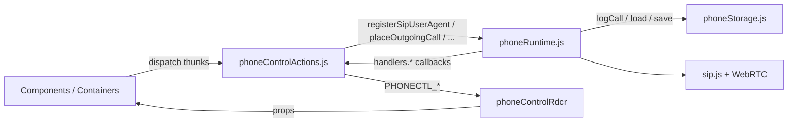
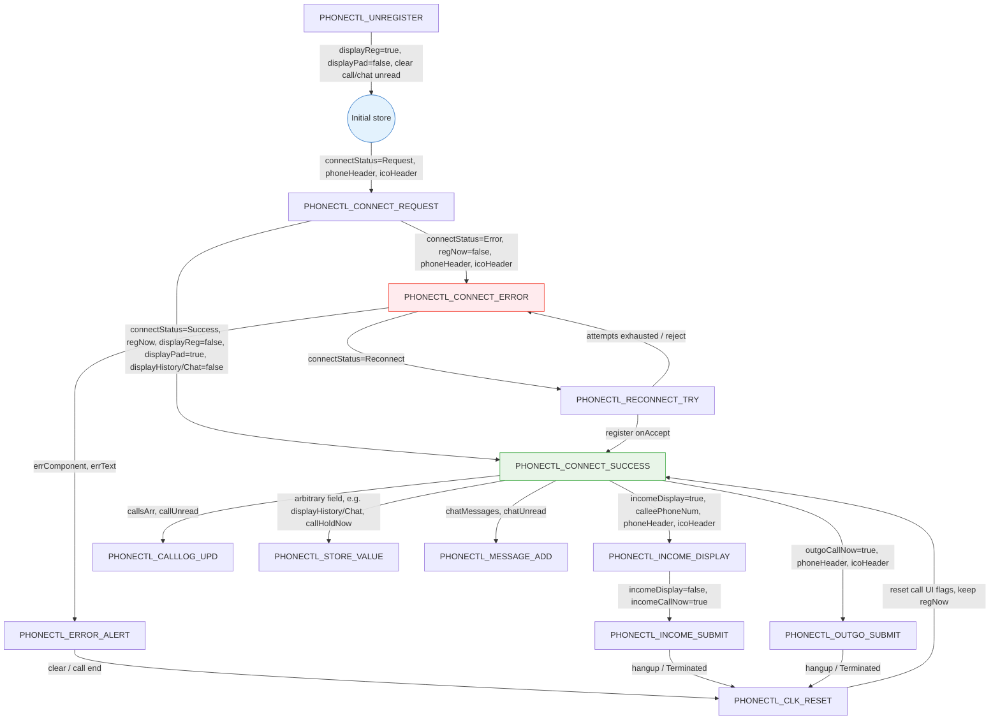
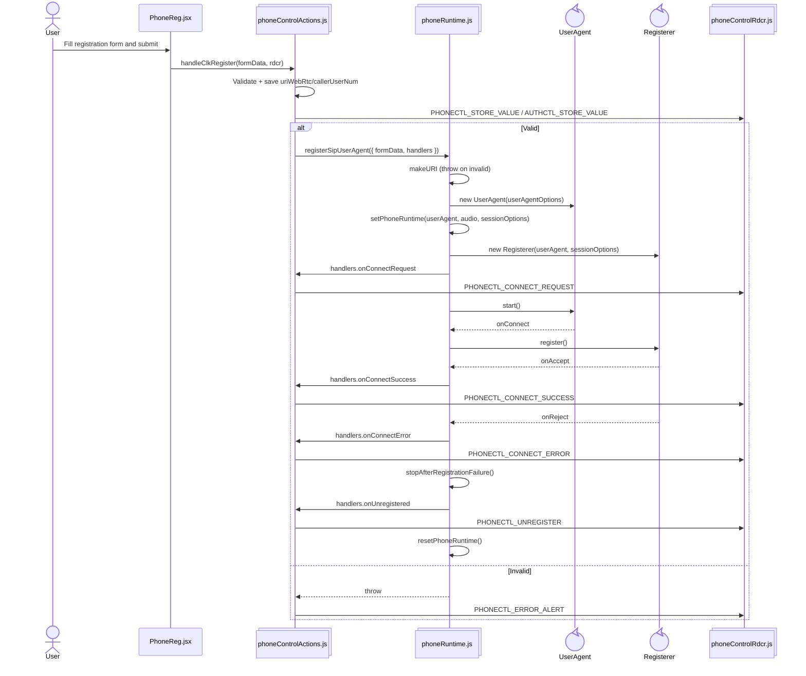
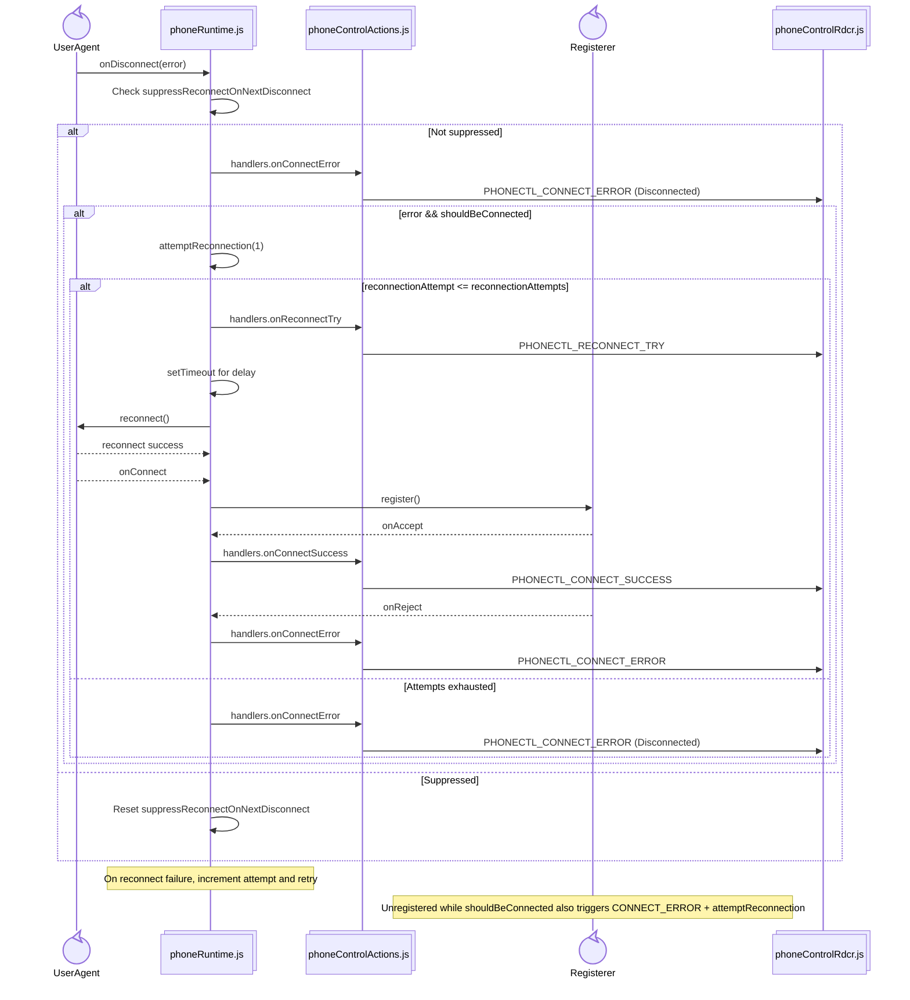
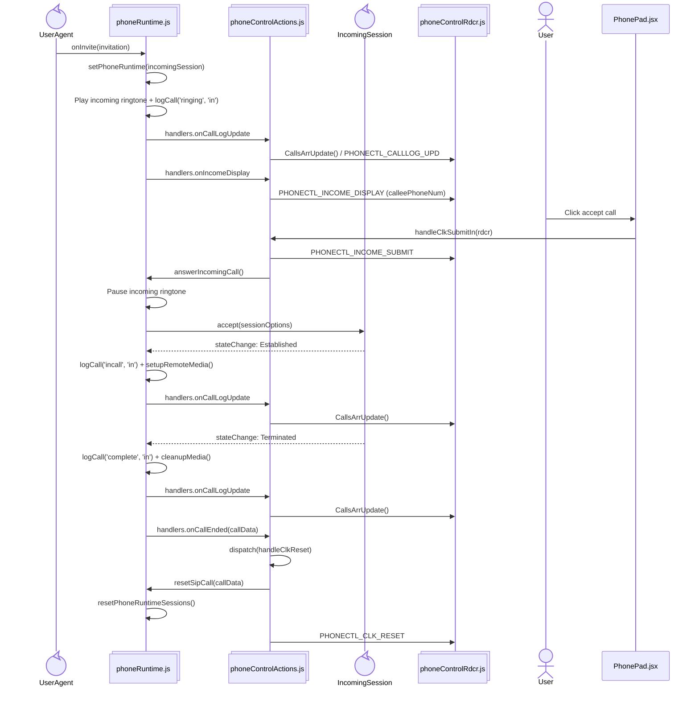
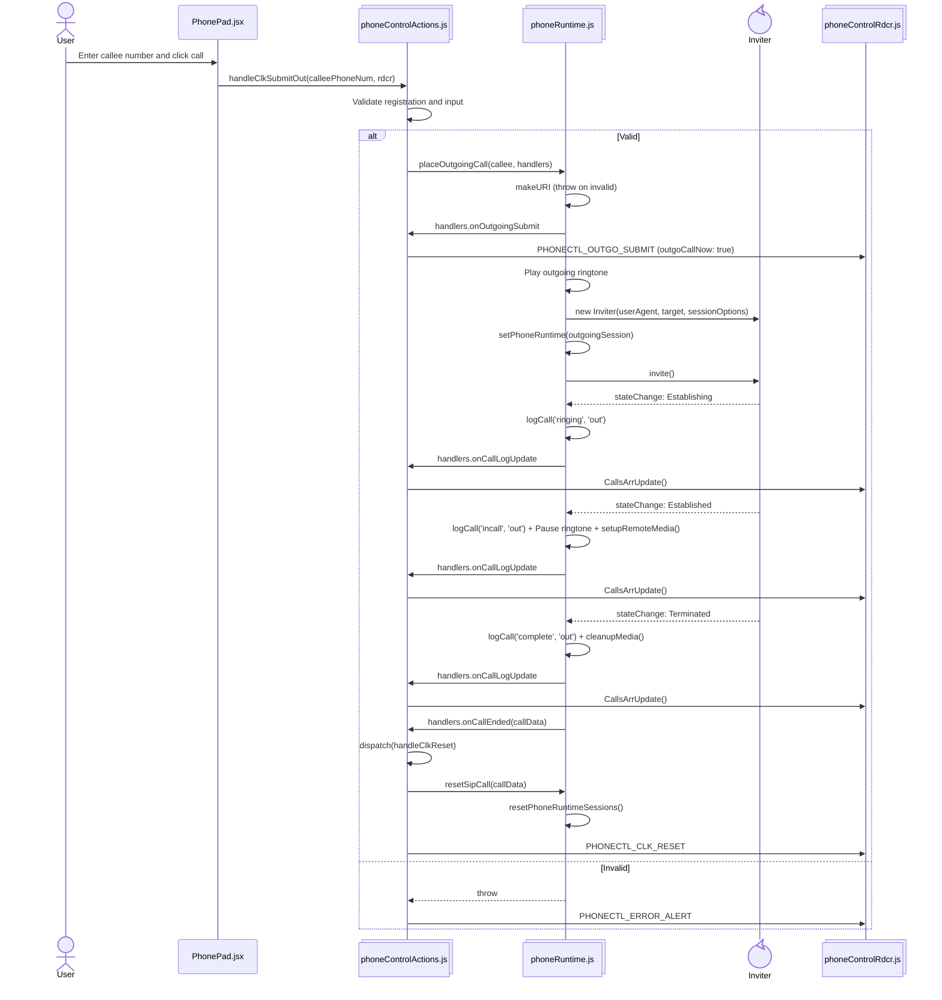
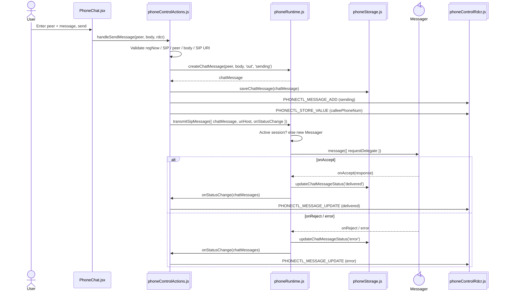
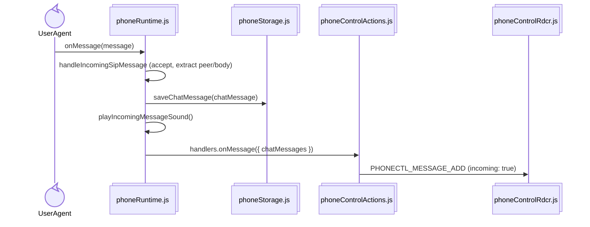

# phone
Готовая сборка в [dist](dist).

## Архитектура состояния

SIP/WebRTC-объекты и медиа живут вне Redux — в сервисах `src/services/`. В store только UI-флаги, заголовки, лог звонков и чат.

`phoneRuntime` (singleton): `userAgent`, `registerer`, `sessionOptions`, `incomingSession` / `outgoingSession`, audio elements, `remoteStream`. Публичное API — высокоуровневые функции; обратная связь в actions — через колбэки `handlers`.

Смежные сервисы:

- `lkRuntime.js` — LiveKit-комната (`getLiveKitRoom`).
- `phoneNotifications.js` — Service Worker / Notifications.
- `phoneStorage.js` — персистенс звонков и чата в `localStorage`.

## Состояние Redux store (`phoneControlRdcr`)

## SIP регистрация

## Восстановление сетевого обрыва / перерегистрация

## Входящий звонок

## Исходящий звонок

## Чат

Исходящее SIP MESSAGE: `handleSendMessage` → `transmitSipMessage` (через активную сессию или `Messager`), статусы `sending` / `delivered` / `error`.

Входящее SIP MESSAGE обрабатывается в `userAgent.delegate.onMessage` внутри `registerSipUserAgent`:

