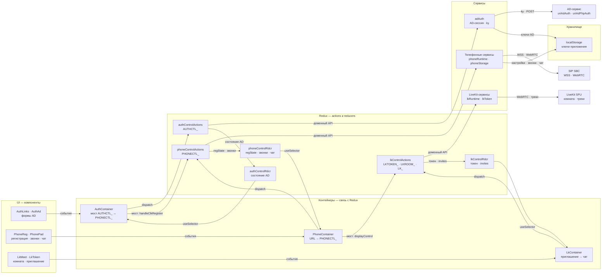
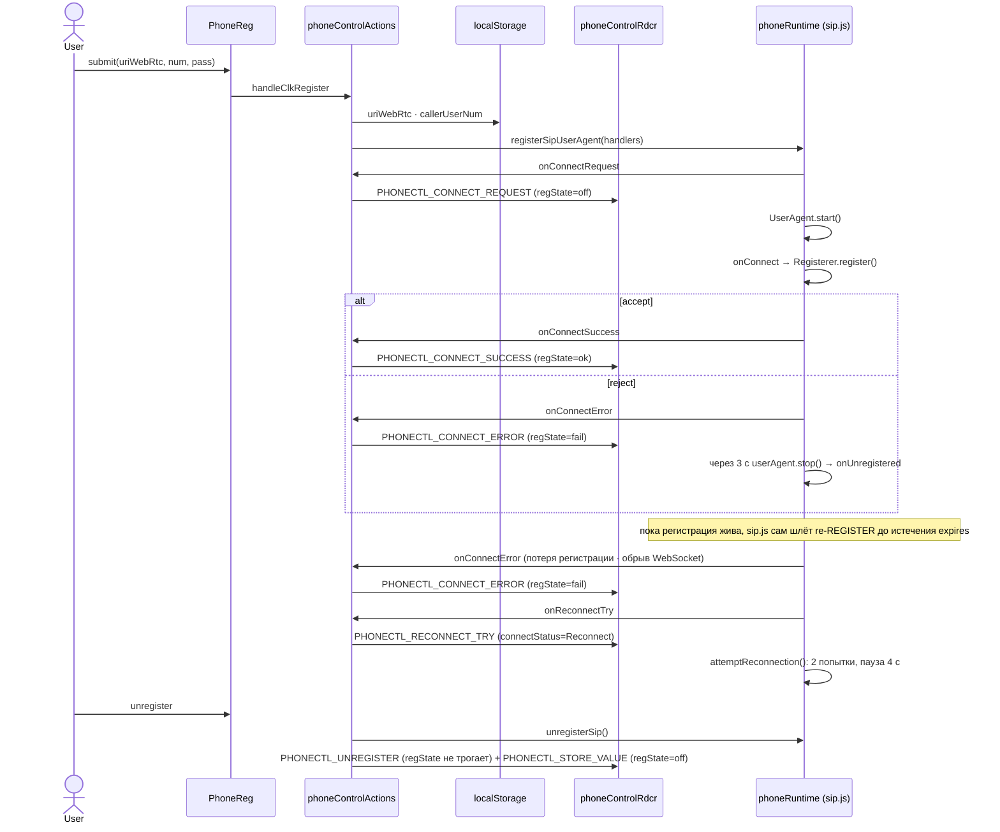
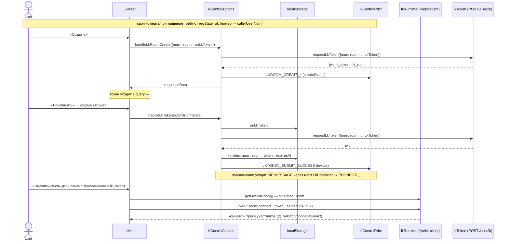

# Архитектура sipjs-react

**Правило документации: archify первичен.** Источник истины — интерактивные диаграммы в
[`docs/archify/`](archify/) (JSON-спецификация + собранный HTML). Mermaid-блоки ниже — только
короткий повтор первичной диаграммы (её сообщений и карточек) с комментариями по ключевым
моментам: новых фактов и более подробных потоков в них нет. Нужен новый факт — сначала правится
archify-спека и пересобирается HTML, и только потом повтор появляется здесь. Полный свод правил
проекта — в [AGENTS.md](../AGENTS.md).

## 1. Архитектура

[Диаграмма](archify/sipjs-react-architecture.html).

- Три среза и их внешние ресурсы: `AUTHCTL_` → `adAuth` → AD-сервис (`ky`),
  `PHONECTL_` → `phoneRuntime` → SIP SBC (`WSS`), `LKTOKEN_`/`LKROOM_`/`LK_` →
  `lkRuntime`/`lkToken` → LiveKit SFU. Thunk-и не диспатчат чужой префикс.
- Слои: UI → контейнеры → Redux (`actions` и `reducers`) → сервисы; `localStorage` — общее
  хранилище трёх срезов (ключи — `constants/storage.js`), сид в store собирает
  `store/preloadedState.js`. AD-сервис, SIP SBC и LiveKit SFU — внешние блоки вне слоёв.
- Мосты только в контейнерах: `AuthContainer` (`AUTHCTL_` ↔ `PHONECTL_`, URL `lk_token` → `LK_`),
  `PhoneContainer` (URL → `PHONECTL_`; кнопка LiveKit → `lkControlRdcr.displayControl`),
  `LkContainer` (приглашение → SIP MESSAGE через `PHONECTL_`).



- Срезы `AUTHCTL_`, `PHONECTL_` и `LKTOKEN_`/`LKROOM_`/`LK_` идут строками (суффикс в подписях
  узлов): состояние каждого — свой редьюсер (`authControlRdcr`, `phoneControlRdcr`,
  `lkControlRdcr`), а переход между срезами есть только в контейнерах: `AuthContainer`
  (`AUTHCTL_` ↔ `PHONECTL_`, URL `lk_token` → `LK_`), `PhoneContainer` (кнопка LiveKit →
  `lkControlRdcr.displayControl`), `LkContainer` (приглашение → SIP MESSAGE через `PHONECTL_`).
- У каждого среза свой сервис и внешний ресурс, а ключи всех трёх лежат в `localStorage`
  (`adAuth`, `phoneStorage`, `lkToken`); весь HTTP (`ky`) тоже только в `services/`.
- Регистрация: `AuthAd` открывается лишь неуспешной пробивкой PHP-сессии
  (`GET uriAdPhpAuth?PHPSESSID=...`); успех — тихий вход без формы, ошибкой AD пробивка не
  считается.

## 2. SIP регистрация

[Диаграмма](archify/sipjs-react-sip-store.html).

- `phoneControlRdcr.regState` (`off`/`ok`/`fail`) — единственный флаг SIP-регистрации; тумблер
  `AuthPad` трёхпозиционный и отражает его напрямую (отдельного булева флага нет).
  `PHONECTL_UNREGISTER` намеренно не сбрасывает `regState` — красный тумблер переживает
  авто-стоп, явная разрегистрация возвращает `off` отдельным `PHONECTL_STORE_VALUE`.
- Продление и переподключение: re-REGISTER до истечения `expires` шлёт сам sip.js, стор в этом не
  участвует; потеря регистрации или обрыв WebSocket — `onConnectError` +
  `attemptReconnection()` (2 попытки, пауза 4 с); отказ регистрации гасит UserAgent через 3 с
  (`onUnregistered` с `registrationLost`).
- Уход со страницы (F5): пока `regState === "ok"`, `beforeunload` держит диалог браузера; после
  подтверждённого ухода `pagehide` вызывает `handleUnregisterOnUnload()` → `unregisterSip()` —
  REGISTER с `Expires: 0` уходит сразу, ответа ждать некому; уход в bfcache
  (`persisted === true`) сессию не рвёт.
- Хранилище: `uriWebRtc` и `callerUserNum` пишет `phoneStorage` при `handleClkRegister`; `useIce`
  только читается (`getStoredUseIce`, без ключа — `true`); сид среза собирает
  `store/preloadedState.js`.



Звонки, DTMF, hold и чат — те же три звена (`Action → phoneRuntime → PHONECTL_*`): сценарии в
`src/actions/phoneControlActions.js`, состояния runtime — в `src/services/phoneRuntime.js`.

## 3. LiveKit комнаты

[Диаграмма](archify/sipjs-react-livekit-store.html).

- Условие доступа — SIP, не AD: своя комната и приглашение доступны только при живой
  регистрации (`regState === "ok"`, номер — `callerUserNum`); приглашение уходит SIP MESSAGE,
  AD для него не нужен.
- Хранилище: `uriLkToken` пишет `lkToken` на пути «Пригласить» перед запросом токена;
  приглашения — `localStorage.lkInvites` (лимит `LK_MAX_INVITES`, одно актуальное на номер,
  запись `num · room · token · expiresAt · createdAt`); `uriLk` — адрес SFU, только читается.
  В срез `lkControlRdcr` всё попадает сидом `store/preloadedState.js`.
- Комната и токен — производные query (`#/?lk_room=…&lk_token=…`), в состоянии их копий нет;
  список приглашений виден только в своей комнате (`callerUserNum === room`) при живой
  регистрации, крестик — `handleRemoveInvite`.



Эндпоинт выдачи токена `uriLkToken` и список приглашений пишет `lkToken`; форма приглашения
(`LkToken`) заполняет `num`, `room` и эндпоинт. Стенд (OpenVidu), готовый токен и грабли
проверки — `docs/LIVEKIT.md`.

## 4. Хранилища

`localStorage` доступен только сервисам; ключи объявлены в `src/constants/storage.js`.

## 5. Документация archify: первичный источник

Диаграммы собираются навыком `archify`, отрисовка проверяется навыком `archify-visual-check`
(оба — плагин профиля `web`); готовые HTML и JSON руками не правятся.

```bash
ARCHIFY="$HOME/.dsh/profiles/web/node_modules/@tt-a1i/archify-dsh/skills/archify/bin/archify.mjs"

# 1. Приёмка спеки: 9/9 проверок, composition 0 ошибок / 0 предупреждений
node "$ARCHIFY" validate architecture docs/archify/<name>.architecture.json \
  --quality showcase --repo-root . --json

# 2. Сборка: единственная пишущая команда, печатает SHA-256 и байты спеки и артефакта
node "$ARCHIFY" deliver architecture docs/archify/<name>.architecture.json \
  docs/archify/<name>.html --quality showcase --repo-root . --json

# 3. Визуальный контроль: containment и light/dark скриншоты, HTML не меняет
node "$ARCHIFY" visual-check docs/archify/<name>.html --json
```

- Профиль качества — `showcase`; для sequence меняется только тип (`validate sequence`), а
  `--repo-root .` не нужен: поле `meta.repository` есть только у architecture.
- Раскладка артефактов: `<name>.<type>.json` (спека) + `<name>.html` (артефакт) +
  `<name>.visual-check.*` (receipt, скриншоты, contact sheet).
- `visual-check` всегда пишет `visualReview: "pending"`: скриншоты — материал для глаза, а не
  автоматическое подтверждение отрисовки; визуальную приёмку делает навык
  `archify-visual-check`.
- Подписи в артефактах — по-русски, как и в этом файле; имена продуктов, команд и API остаются
  английскими.
