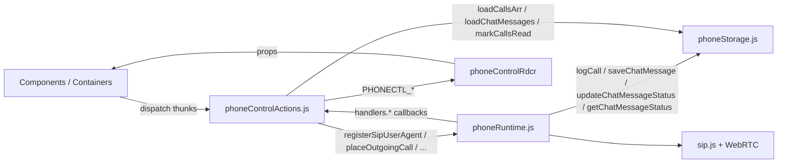
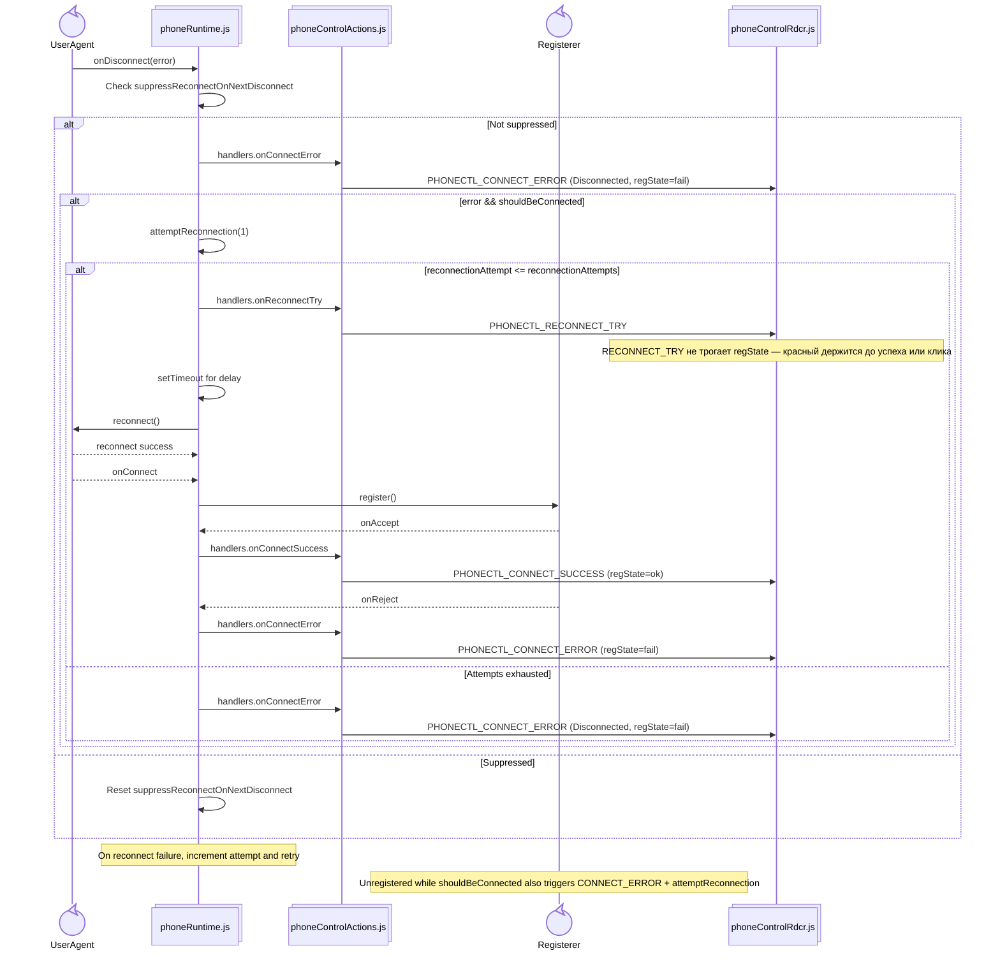
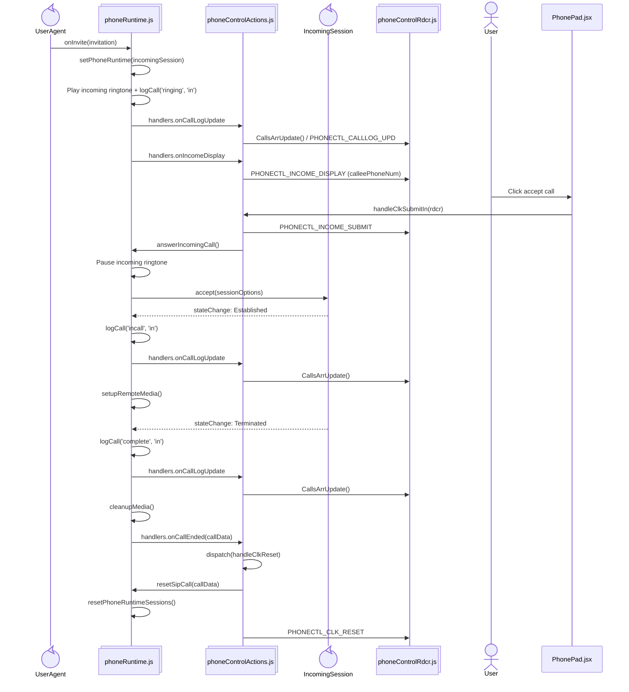
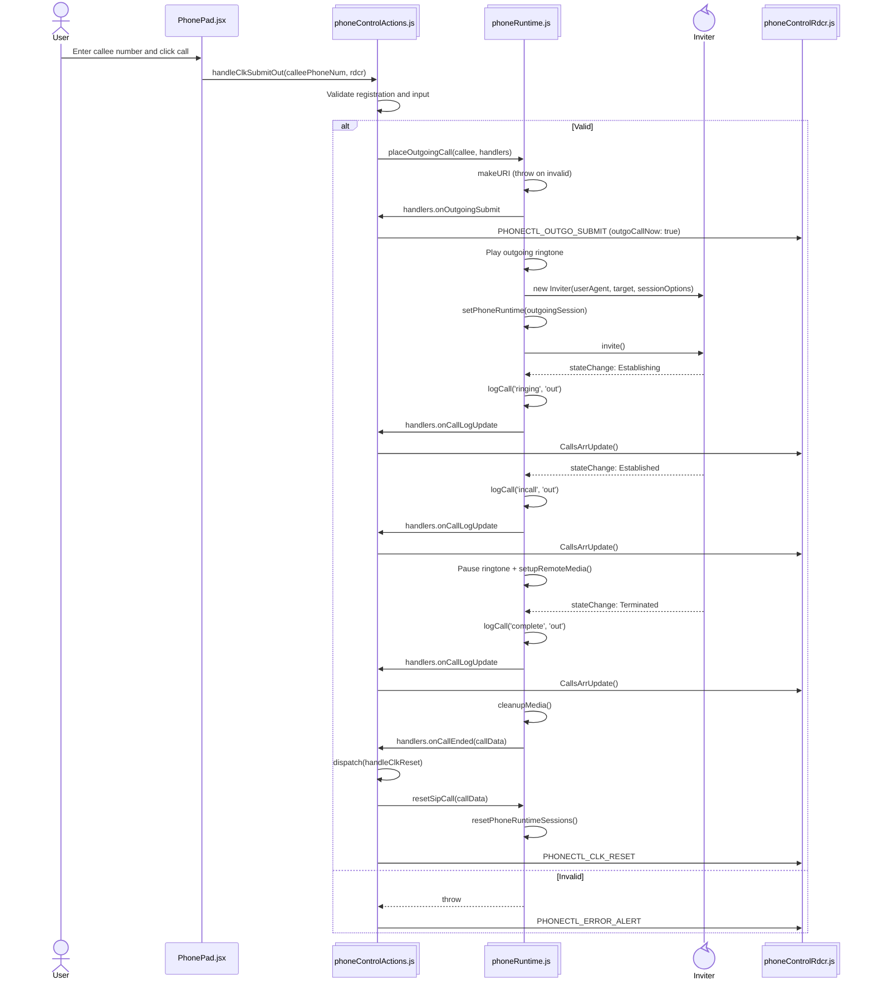
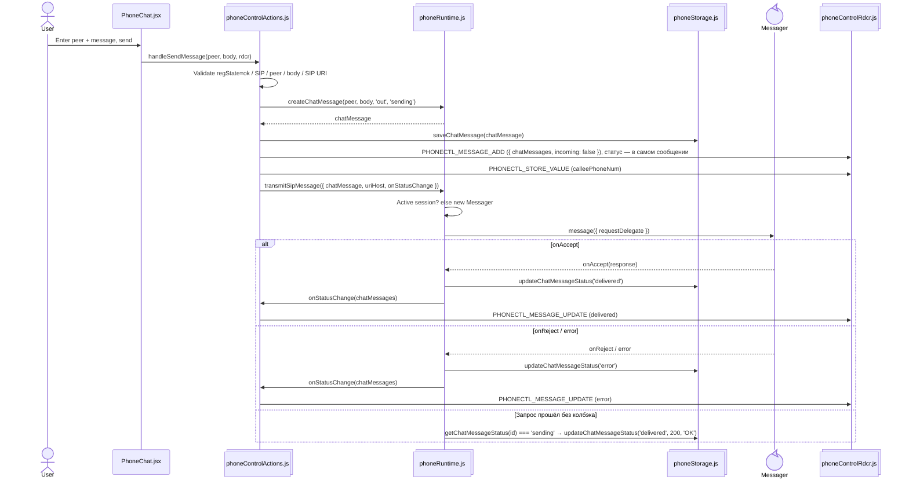
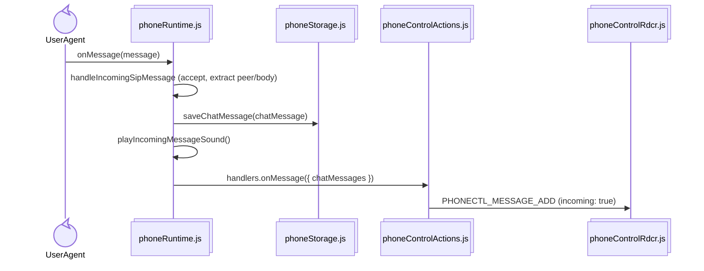

# phone
Сборка — `npm run build` в `dist/` (каталог в git не хранится).

## Архитектура состояния

SIP/WebRTC-объекты и медиа живут вне Redux — в сервисах `src/services/`. В store — UI-флаги, заголовки, лог звонков, чат, а также настройки подключения (`uriWebRtc`, `callerUserNum`, `useIce`, `addPrefix`, `calleePrefix`) и введённый SIP-пароль `regUserPass`.



Слой `src/store/` — единственное место, где стор сходится с сервисами: `preloadedState.js` через геттеры сервисов собирает сид (`uriWebRtc`, `callerUserNum`, `useIce`, `uriAdAuth`, `uriLk`, `uriLkToken`) и полные срезы из `initialState` редьюсеров, `configureStore.js` передаёт их в `createStore` как `preloadedState` (thunk + `authTimeoutMiddleware`, в dev ещё `redux-logger`) и инжектит зависимости middleware. `rootReducer.js` — `combineReducers` трёх срезов. Reducers и middleware сервисов не импортируют.

`phoneRuntime` (singleton): `userAgent`, `registerer`, `sessionOptions`, `incomingSession` / `outgoingSession`, audio elements, `remoteStream`. Публичное API — функции сценариев (`registerSipUserAgent`, `placeOutgoingCall`, `answerIncomingCall`, `transmitSipMessage`, `resetSipCall`, `unregisterSip`) и утилиты (`getUriHostFromWebRtc`, `isSipConnected`, `isValidSipTarget`, `sendDtmf`, `setHold`, `createChatMessage`); обратная связь в actions — через колбэки `handlers`.

Смежные сервисы:

- `lkRuntime.js` — LiveKit-комната (singleton, `getLiveKitRoom`).
- `adAuth.js` — AD-вход (`loginAd`), адрес сервиса и срок AD-сессии в `localStorage`.
- `lkToken.js` — конфиг LiveKit и запрос токена (`requestLkToken`).
- `phoneDirectory.js` — HTTP телефонного справочника.
- `phoneNotifications.js` — Service Worker / Notifications.
- `phoneStorage.js` — настройки подключения, звонки и чат в `localStorage`.

## Состояние Redux store (`phoneControlRdcr`)

```mermaid
flowchart TD
  Init@{ shape: circle, label: "Initial store" }
  CR[PHONECTL_CONNECT_REQUEST]
  CS[PHONECTL_CONNECT_SUCCESS]
  CE[PHONECTL_CONNECT_ERROR]
  RC[PHONECTL_RECONNECT_TRY]
  UN[PHONECTL_UNREGISTER]
  RS[PHONECTL_CLK_RESET]
  ID[PHONECTL_INCOME_DISPLAY]
  IS[PHONECTL_INCOME_SUBMIT]
  OS[PHONECTL_OUTGO_SUBMIT]
  CL[PHONECTL_CALLLOG_UPD]
  SV[PHONECTL_STORE_VALUE]
  EA[PHONECTL_ERROR_ALERT]
  MA[PHONECTL_MESSAGE_ADD]
  MU[PHONECTL_MESSAGE_UPDATE]
  ML[PHONECTL_MESSAGES_LOAD]
  CU[PHONECTL_CHAT_UNREAD_CLEAR]
  CC[PHONECTL_CLEAR_CHAT]

  Init -->|connectStatus=Request, regState=off, phoneHeader, icoHeader| CR
  CR -->|connectStatus=Success, regState=ok, displayReg=false, displayPad=true, displayHistory/Chat=false| CS
  CR -->|connectStatus=Error, regState=fail, phoneHeader, icoHeader| CE
  CS -->|outgoCallNow из payload, callHoldNow=false, phoneHeader, icoHeader| OS
  CS -->|incomeDisplay=true, calleePhoneNum, phoneHeader, icoHeader| ID
  ID -->|incomeDisplay=false, incomeCallNow=true, callHoldNow=false, phoneHeader, icoHeader| IS
  CS -->|callsArr, callUnread=0 при displayHistory| CL
  CS -->|arbitrary field, e.g. displayHistory/Chat, callHoldNow| SV
  CS -->|chatMessages, chatUnread+1 при incoming и !displayChat| MA
  CS -->|chatMessages, смена статуса доставки| MU
  CS -->|chatMessages из localStorage| ML
  CS -->|chatUnread=0| CU
  CS -->|chatMessages пустой, chatUnread=0| CC
  CE -->|connectStatus=Reconnect| RC
  RC -->|register onAccept| CS
  RC -->|attempts exhausted / reject| CE
  CE -->|errComponent, errText| EA
  EA -->|clear / call end| RS
  IS -->|hangup / Terminated| RS
  OS -->|hangup / Terminated| RS
  RS -->|reset call UI flags, connectStatus пустой, regState сохраняется| CS
  UN -->|connectStatus пустой, regState сохраняется (красный тумблер AuthPad), заголовки «Не зарегистрирован», displayReg=false при payload.registrationLost (потеря регистрации, PhoneReg не форсируем) и true при явной разрегистрации, displayPad/History/Chat=false, счётчики unread=0, флаги звонка=false, calleePhoneNum/errComponent/errText пустые| Init

  classDef initial fill:#e3f2fd,stroke:#1565c0,stroke-width:1px
  classDef success fill:#e8f5e8,stroke:#4caf50,stroke-width:1px
  classDef error fill:#ffebee,stroke:#f44336,stroke-width:1px

  class Init initial
  class CS success
  class CE error
```

## Мост к сервисам (`AuthContainer`)

Thunk-и namespace-чистые: `authControlActions` не диспатчит `PHONECTL_`, `phoneControlActions` — `AUTHCTL_`. Оба моста `AUTHCTL_` ↔ `PHONECTL_` живут в `AuthContainer`; чужой срез thunk-и не читают через `getState()`, а получают нужные значения аргументом (`uriWebRtc` в `handleLkTokenSubmit`, `rdcr` в `handleClkRegister`/`handleSendMessage`). Остальные контейнеры только раздают срезы пропсами — `LkContainer` → `phoneControlRdcr` для формы приглашения `LkToken`. `AuthPad` рендерится по флагу `displayAuthPad` (строка меню; ✕ снимает флаг), который выставляется в `true` на `AUTHCTL_SUBMIT_SUCCESS` и сбрасывается на `AUTHCTL_CLEAR`; при отсутствии AD-данных `AuthPad` информирует текстом. Её тумблер трёхпозиционный и отражает `phoneControlRdcr.regState` (`off` / `ok` — зелёный / `fail` — красный): выключенный тумблер заблокирован без пары `sip_username`/`sip_secret`, клик из `off` запускает регистрацию, из `ok` — разрегистрацию, из `fail` — возвращает в `off`. Потеря регистрации (`regState` → `fail`) дополнительно форсирует `displayAuthPad` — форма `PhoneReg` при этом не появляется, а красный тумблер AuthPad остаётся кликабельным (✕ панель всё равно закрывает: `displayAuthPad` намеренно не в зависимостях эффекта).

```mermaid
sequenceDiagram
  actor User
  participant AuthAd@{ "type" : "participant", "alias": "AuthAd.jsx" }
  participant AuthPad@{ "type" : "participant", "alias": "AuthPad.jsx" }
  participant AuthAct@{ "type" : "collections", "alias": "authControlActions.js" }
  participant AdAuth@{ "type" : "collections", "alias": "adAuth.js" }
  participant AuthCont@{ "type" : "collections", "alias": "AuthContainer.jsx" }
  participant PhoneAct@{ "type" : "collections", "alias": "phoneControlActions.js" }
  participant Dispatch@{ "type" : "collections", "alias": "authControlRdcr / phoneControlRdcr" }

  User->>AuthAd: Ввод AD-логина и пароля
  AuthAd->>AuthAct: handleAdRegister(formData)
  alt Валидация не прошла или HTTP-ошибка
    AuthAct->>Dispatch: AUTHCTL_SUBMIT_ERROR (errText)
  else Успех
    AuthAct->>Dispatch: AUTHCTL_SUBMIT_REQUEST (responseData=null)
    AuthAct->>AdAuth: loginAd({ login, password, uriAdAuth })
    AdAuth->>AdAuth: POST uriAdAuth, сохранить адрес и AD-сессию
    AdAuth-->>AuthAct: responseData
    AuthAct->>Dispatch: AUTHCTL_SUBMIT_SUCCESS (responseData)
  end
  AuthCont->>Dispatch: PHONECTL_STORE_VALUE (callerUserNum, regUserPass, displayDir)
  Note over AuthCont: displayAuthPad=true на success → рендер AuthPad (тумблер off; при неполном AD-ответе — текст с недостающими полями)
  User->>AuthPad: Клик по тумблеру (off)
  AuthPad->>AuthCont: onToggleReg()
  AuthCont->>PhoneAct: handleClkRegister({callerUserNum: sip_username, regUserPass: sip_secret, uriWebRtc}, phoneControlRdcr)
  PhoneAct->>Dispatch: PHONECTL_CONNECT_REQUEST (regState=off) → SUCCESS (regState=ok) / ERROR (regState=fail)
  Dispatch-->>AuthCont: callerUserNum из PhoneReg
  Note over AuthCont: sync только при callerUserNum и (regState=ok или connectStatus)
  AuthCont->>Dispatch: AUTHCTL_STORE_VALUE (responseData.sip_username)
  User->>AuthPad: Клик по цветному тумблеру (ok)
  AuthPad->>AuthCont: onToggleReg()
  AuthCont->>PhoneAct: handleClkUnregister(phoneControlRdcr)
  PhoneAct->>Dispatch: PHONECTL_UNREGISTER + PHONECTL_STORE_VALUE (regState=off)
```

Отдельно: `AuthContainer` синхронизирует `phoneControlRdcr.callerUserNum` → `authControlRdcr.responseData.sip_username` (используется `AuthAdInfo` и `LkMeet`), а тумблер «LiveKit Встреча» переключает `lkControlRdcr.displayControl` — показ компоненты `LkMeet` (заблокирован без `lk_token`; если AD не выполнен или нет `lk_token`, `LkMeet` показывает информирующий текст). Клик по красному тумблеру (`fail`) разрегистрировать нечего — `AuthContainer` возвращает `regState` в `off` через `phoneControlActions.handleChangeStore`. `regState` живёт в `phoneControlRdcr`: `off` на `PHONECTL_CONNECT_REQUEST`, `ok` на `PHONECTL_CONNECT_SUCCESS`, `fail` на `PHONECTL_CONNECT_ERROR`; `PHONECTL_UNREGISTER` его не трогает (иначе красный гас бы через 3 с вместе с авто-остановом `UserAgent` после неуспешной регистрации), а явная разрегистрация (`handleClkUnregister`) сбрасывает в `off` отдельным `PHONECTL_STORE_VALUE`. Тот же переход в `fail` форсирует `displayAuthPad` (мост `PHONECTL_` → `AUTHCTL_`): при потере регистрации показывается AuthPad с красным тумблером, а не `PhoneReg`; `displayReg=false` для этого случая выставляет редьюсер по `payload.registrationLost`, который подставляет только авто-путь `phoneRuntime` (`onUnregistered` в `handleClkRegister`). `regState` — единственный флаг регистрации в срезе: булев `regNow` удалён, все проверки «зарегистрирован» — `regState === "ok"` (`isRegistered` в `phoneControlActions`, `isRegistered` в `AuthContainer`).

## SIP регистрация

```mermaid
sequenceDiagram
  actor User
  participant PhoneReg@{ "type" : "participant", "alias": "PhoneReg.jsx" }
  participant Action@{ "type" : "collections", "alias": "phoneControlActions.js" }
  participant Runtime@{ "type" : "collections", "alias": "phoneRuntime.js" }
  participant UserAgent@{ "type" : "control" }
  participant Registerer@{ "type" : "control" }
  participant Dispatch@{ "type" : "collections", "alias": "phoneControlRdcr.js" }

  User->>PhoneReg: Fill registration form and submit
  PhoneReg->>Action: handleClkRegister(formData, rdcr)
  alt Поля не заполнены
    Action->>Dispatch: PHONECTL_ERROR_ALERT
  else Valid
    Action->>Action: save uriWebRtc и callerUserNum в phoneStorage
    Action->>Dispatch: PHONECTL_STORE_VALUE (uriWebRtc)
    Action->>Dispatch: PHONECTL_STORE_VALUE (callerUserNum)
    Note over Action: sync sip_username в authControlRdcr делает AuthContainer
    Action->>Runtime: registerSipUserAgent({ formData, handlers })
    Runtime->>Runtime: makeURI (throw on invalid)
    Runtime->>UserAgent: new UserAgent(userAgentOptions)
    Runtime->>Runtime: setPhoneRuntime(userAgent, audio, sessionOptions)
    Runtime->>Registerer: new Registerer(userAgent, sessionOptions)
    Runtime->>Action: handlers.onConnectRequest
    Action->>Dispatch: PHONECTL_CONNECT_REQUEST (regState=off)
    Runtime->>UserAgent: start()
    UserAgent-->>Runtime: onConnect
    Runtime->>Registerer: register()
    Registerer-->>Runtime: onAccept
    Runtime->>Action: handlers.onConnectSuccess
    Action->>Dispatch: PHONECTL_CONNECT_SUCCESS (regState=ok, зелёный тумблер AuthPad)
    Registerer-->>Runtime: onReject / start().catch
    Runtime->>Action: handlers.onConnectError
    Action->>Dispatch: PHONECTL_CONNECT_ERROR (regState=fail, красный тумблер AuthPad)
    Runtime->>Runtime: через 3 с: stopAfterRegistrationFailure()
    Runtime->>Action: handlers.onUnregistered
    Action->>Dispatch: PHONECTL_UNREGISTER (payload.registrationLost=true)
    Note over Dispatch: UNREGISTER не трогает regState и не форсирует PhoneReg (displayReg=false); AuthContainer по regState=fail показывает AuthPad с красным тумблером
    Runtime->>Runtime: resetPhoneRuntime()
  end
  Note over Action: makeURI внутри registerSipUserAgent бросает исключение → catch → PHONECTL_ERROR_ALERT
```

## Восстановление сетевого обрыва / перерегистрация



## Входящий звонок



## Исходящий звонок



## Чат

Исходящее SIP MESSAGE: `handleSendMessage` → `transmitSipMessage` (через активную сессию или `Messager`), статусы `sending` / `delivered` / `error`.



Загрузка и счётчики чата: `MessagesArrUpdate` → `PHONECTL_MESSAGES_LOAD` (из `localStorage`), `handleChatUnreadClear` → `PHONECTL_CHAT_UNREAD_CLEAR`, `handleClearChat` → `PHONECTL_CLEAR_CHAT`.

Входящее SIP MESSAGE обрабатывается в `userAgent.delegate.onMessage` внутри `registerSipUserAgent`:



## Остальные thunk-и

`phoneControlActions.js`:

- `MessagesArrUpdate` → `PHONECTL_MESSAGES_LOAD` из `loadChatMessages()`.
- `CallsArrUpdate` → `PHONECTL_CALLLOG_UPD` из `loadCallsArr()`; при открытой истории помечает звонки прочитанными (единственный `getState()` в actions — по своему срезу).
- `markCallsRead` → `PHONECTL_CALLLOG_UPD` с результатом `markCallsRead()` из storage.
- `handleClkUnregister(rdcr)` → `unregisterSip()` → `PHONECTL_UNREGISTER` + `PHONECTL_STORE_VALUE (regState=off)`; без SIP-подключения или регистрации — `PHONECTL_ERROR_ALERT`.
- `handleClkDtmf(tone, rdcr, options)` → `sendDtmf`; ошибки — `PHONECTL_ERROR_ALERT` (`errComponent: PhonePad`).
- `handleClkHold(rdcr, hold)` → `setHold` → `PHONECTL_STORE_VALUE (callHoldNow)`.
- `handleChangeStore` → `PHONECTL_STORE_VALUE` для произвольного поля среза.
- `handleChatUnreadClear` → `PHONECTL_CHAT_UNREAD_CLEAR`.
- `handleClearChat` → `clearChatMessages()` + `PHONECTL_CLEAR_CHAT`.
- `handleClearHistory` → `clearCallsArr()` + `PHONECTL_STORE_VALUE (callsArr=[])`.
- `getPhoneDir` → `fetchPhoneDir(getStoredPhoneDirUri())`; ошибки преобразует `actions/utils/kyError.js`.

`authControlActions.js`: `handleAdRegister` (AD-вход), `handleAdAuthClear` (`AUTHCTL_CLEAR` + сброс AD-сессии), `handleChangeStore` (`AUTHCTL_STORE_VALUE`).
`lkControlActions.js`: `handleLkTokenSubmit` (токен + SIP MESSAGE-приглашение), `handleLkTokenClear` (`LKTOKEN_CLEAR` + сброс только результата запроса), `handleChangeStore` (`LK_STORE_VALUE`).
