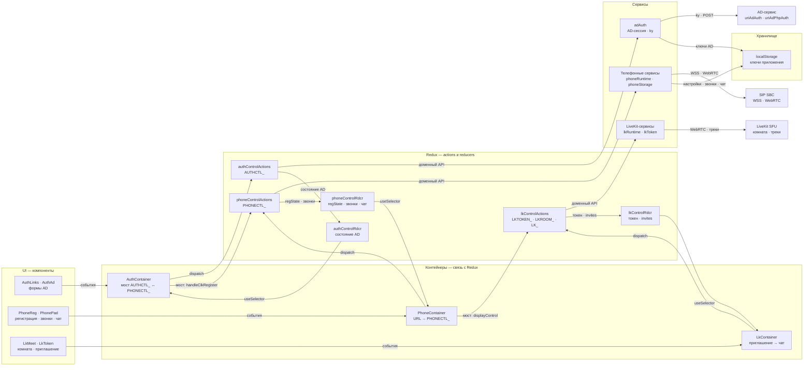
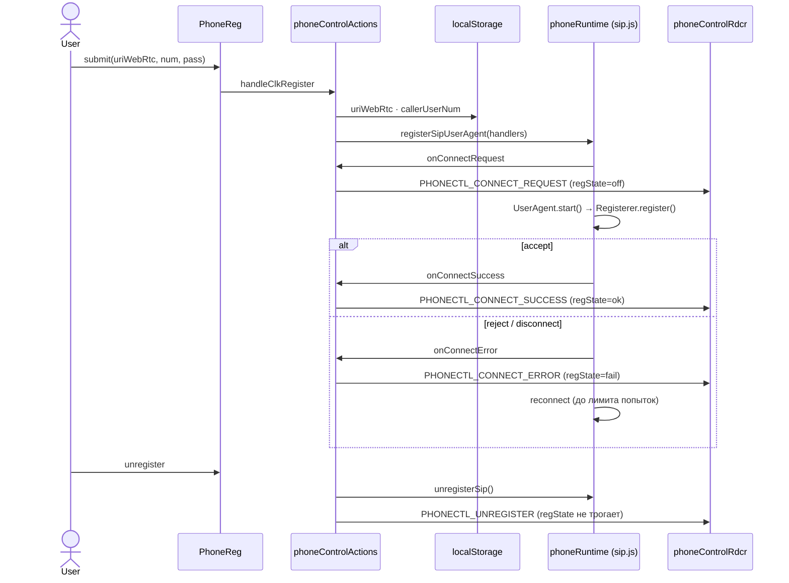
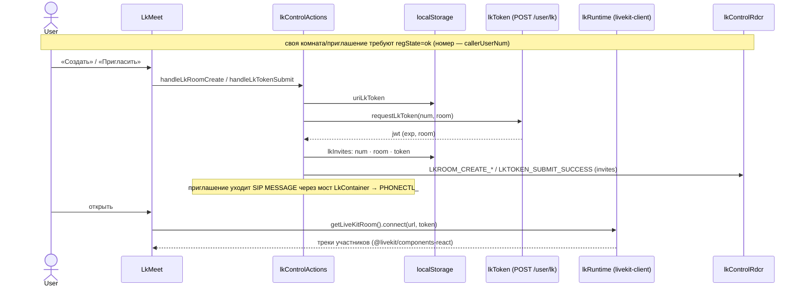

# phone — ключевые диаграммы

Сборка — `npm run build` в `dist/` (каталог в git не хранится). Полное описание правил и границ —
`AGENTS.md`; стенд и токены LiveKit — `docs/LIVEKIT.md`. Здесь — только 3 ключевые схемы, без
пересказа всех веток редьюсеров и thunk-ов (они читаются из кода).

## 1. Архитектура

Интерактивная версия — [Архитектура (archify)](archify/sipjs-react-architecture.html).
SIP/WebRTC- и LiveKit-объекты живут вне Redux — в сервисах; store хранит только UI-флаги,
заголовки, списки и настройки подключения.

- Пунктирные области — слои: UI, контейнеры (связь со store), Redux (`actions` и `reducers`),
  сервисы и хранилище; `AD-сервис`, `SIP SBC` и `LiveKit SFU` — внешние блоки вне слоёв.
- Срезы `AUTHCTL_`, `PHONECTL_` и `LKTOKEN_`/`LKROOM_`/`LK_` идут строками (суффикс в подписях
  узлов): состояние каждого — свой редьюсер (`authControlRdcr`, `phoneControlRdcr`,
  `lkControlRdcr`), а переход между срезами есть только в контейнерах: `AuthContainer`
  (`AUTHCTL_` ↔ `PHONECTL_`, URL `lk_token` → `LK_`), `PhoneContainer` (кнопка LiveKit →
  `lkControlRdcr.displayControl`), `LkContainer` (приглашение → SIP MESSAGE через `PHONECTL_`).
- У каждого среза свой сервис и внешний ресурс: `AUTHCTL_` → `adAuth` → AD-сервис (`ky`),
  `PHONECTL_` → `phoneRuntime` → SIP SBC (`WSS`), `LK_` → `lkRuntime`/`lkToken` → LiveKit SFU;
  ключи всех трёх срезов лежат в `localStorage` (`adAuth`, `phoneStorage`, `lkToken`), а сид в
  store собирает `store/preloadedState.js`.

## 2. SIP регистрация

Звонки, DTMF, hold и чат — те же три звена (`Action → phoneRuntime → PHONECTL_*`), сценарии в
`src/actions/phoneControlActions.js`, состояния runtime — в `src/services/phoneRuntime.js`.
Настройки подключения `uriWebRtc` и `callerUserNum` пишет `phoneStorage` при `handleClkRegister`;
`useIce` только читается (`getStoredUseIce`, без ключа — `true`), сид среза `phoneControlRdcr`
собирает `store/preloadedState.js`.

## 3. LiveKit комнаты

Эндпоинт выдачи токена `uriLkToken` и список приглашений `localStorage.lkInvites` (лимит
`LK_MAX_INVITES`) пишет `lkToken`; сид в срез — через `store/preloadedState.js`. Стенд (OpenVidu),
готовый токен и грабли проверки — `docs/LIVEKIT.md`.
