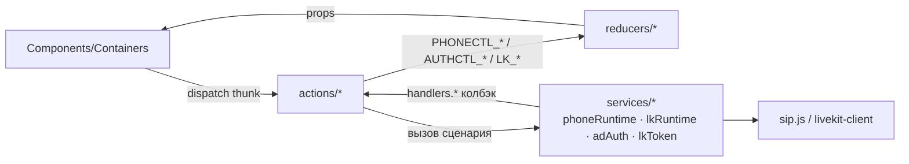
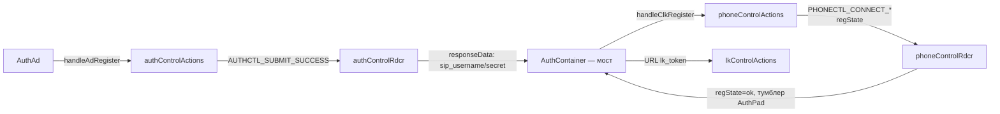
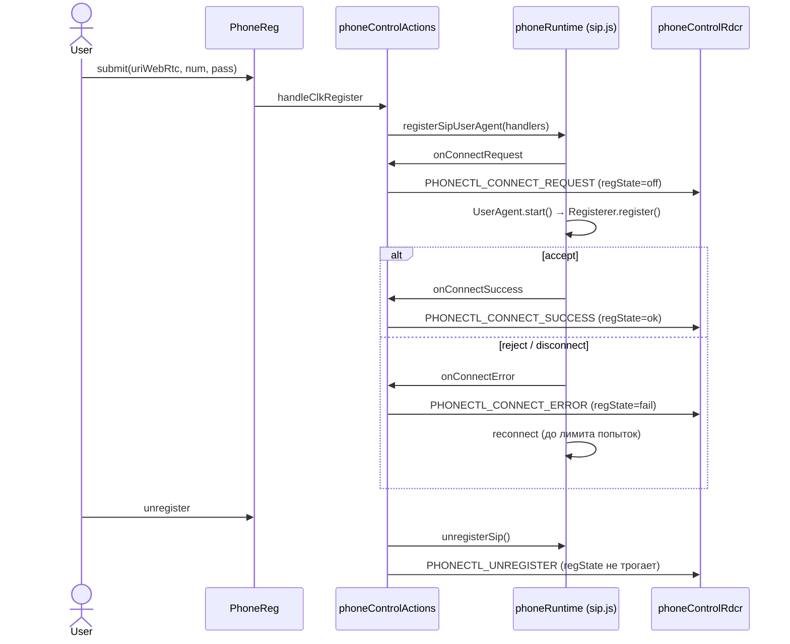
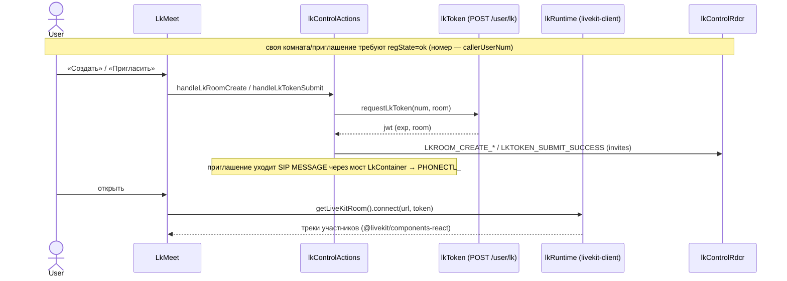

# phone — ключевые диаграммы

Сборка — `npm run build` в `dist/` (каталог в git не хранится). Полное описание правил и границ —
`AGENTS.md`; стенд и токены LiveKit — `docs/LIVEKIT.md`. Здесь — только 4 ключевые схемы, без
пересказа всех веток редьюсеров и thunk-ов (они читаются из кода).

## 1. Слои: UI / store / сервисы

SIP/WebRTC- и LiveKit-объекты живут вне Redux — в сервисах. Store хранит только UI-флаги,
заголовки, списки и настройки подключения.

## 2. Мост auth → сервисы

Thunk-и своего namespace не диспатчат чужой (`AUTHCTL_` ⇏ `PHONECTL_` и наоборот). Единственный
мост — `AuthContainer`: слушает оба среза и вручную вызывает actions другого домена.

`regState` (`off`/`ok`/`fail`) — единственный флаг SIP-регистрации, отражается трёхпозиционным
тумблером `AuthPad`. Подробности переходов и владения рендером — в коде `AuthContainer.jsx` и
`AGENTS.md`.

## 3. Сервис sip.js: регистрация и store

Звонки, DTMF, hold и чат — те же три звена (`Action → phoneRuntime → PHONECTL_*`), сценарии в
`src/actions/phoneControlActions.js`, состояния runtime — в `src/services/phoneRuntime.js`.

## 4. Сервис LiveKit: комнаты и store

Список приглашений — `localStorage.lkInvites` (лимит `LK_MAX_INVITES`), сид в срез — через
`store/preloadedState.js`. Стенд (OpenVidu), готовый токен и грабли проверки — `docs/LIVEKIT.md`.
