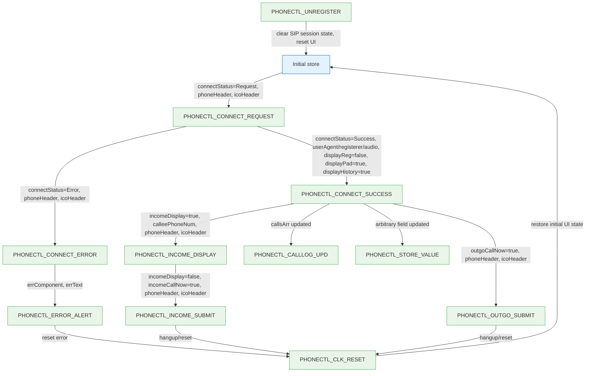
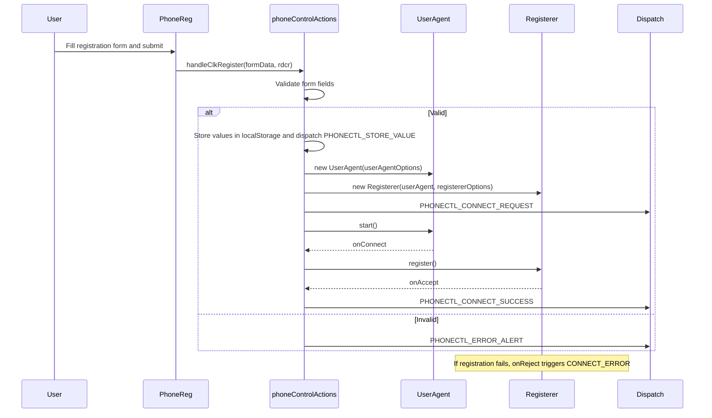
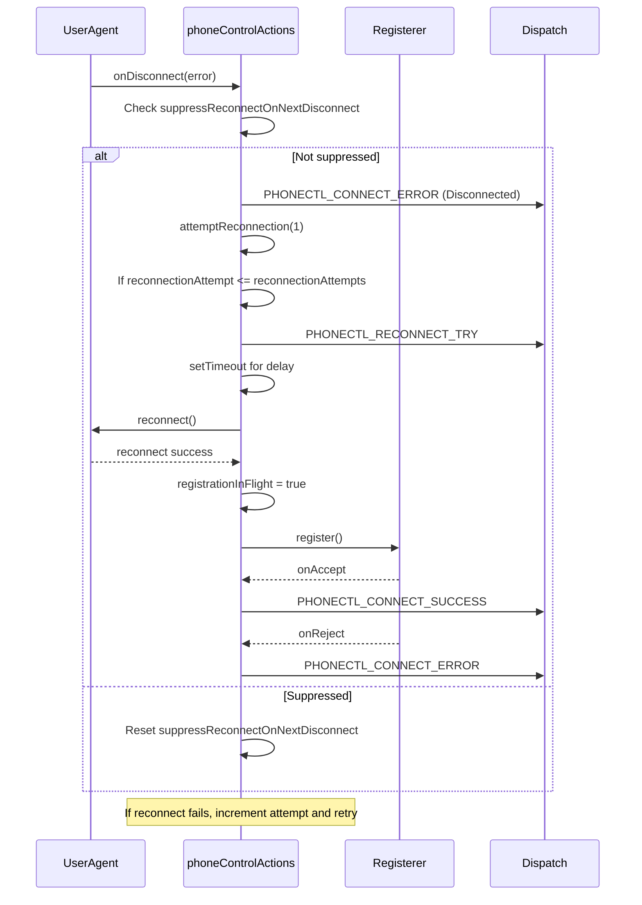
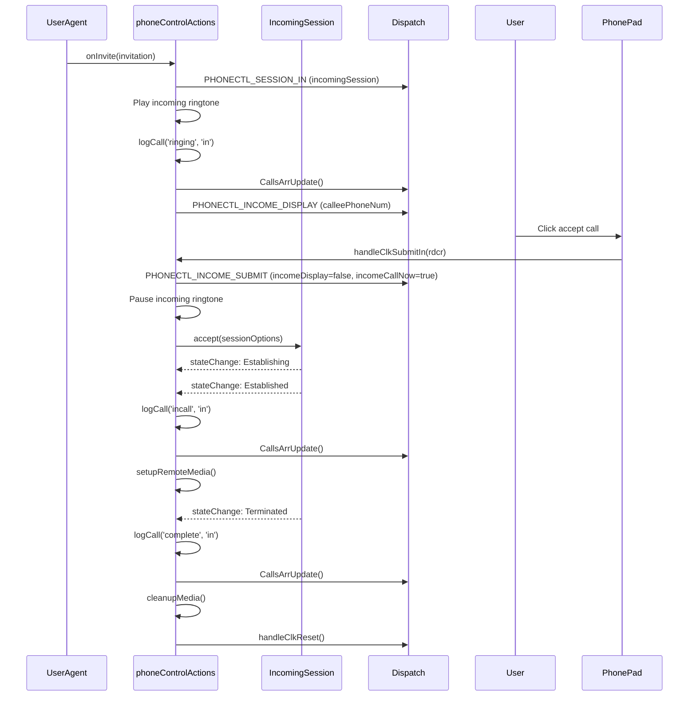
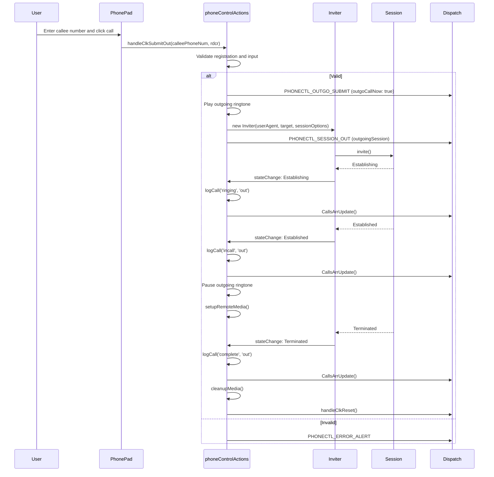

# phone
Готовая сборка в [dist](dist).

## Состояние Redux store

```mermaid
flowchart TD
    Init[Initial store]
    CR[PHONECTL_CONNECT_REQUEST]
    CS[PHONECTL_CONNECT_SUCCESS]
    CE[PHONECTL_CONNECT_ERROR]
    UN[PHONECTL_UNREGISTER]
    RS[PHONECTL_CLK_RESET]
    ID[PHONECTL_INCOME_DISPLAY]
    IS[PHONECTL_INCOME_SUBMIT]
    OS[PHONECTL_OUTGO_SUBMIT]
    CL[PHONECTL_CALLLOG_UPD]
    SV[PHONECTL_STORE_VALUE]
    EA[PHONECTL_ERROR_ALERT]

    Init -->|connectStatus=Request, phoneHeader, icoHeader| CR
    CR -->|connectStatus=Success, userAgent/registerer/audio, displayReg=false, displayPad=true, displayHistory=true| CS
    CR -->|connectStatus=Error, phoneHeader, icoHeader| CE
    CS -->|outgoCallNow=true, phoneHeader, icoHeader| OS
    CS -->|incomeDisplay=true, calleePhoneNum, phoneHeader, icoHeader| ID
    ID -->|incomeDisplay=false, incomeCallNow=true, phoneHeader, icoHeader| IS
    CS -->|callsArr updated| CL
    CS -->|arbitrary field updated| SV
    CE -->|errComponent, errText| EA
    EA -->|reset error| RS
    IS -->|hangup/reset| RS
    OS -->|hangup/reset| RS
    RS -->|restore initial UI state| Init
    UN -->|clear SIP session state, reset UI| Init

    classDef action fill:#e8f5e8,stroke:#4caf50,stroke-width:1px
    classDef state fill:#e3f2fd,stroke:#1565c0,stroke-width:1px
    class CR,CS,CE,UN,RS,ID,IS,OS,CL,SV,EA action
    class Init state
```

## Sequence Diagram для SIP регистрации

```mermaid
sequenceDiagram
    participant User
    participant PhoneReg
    participant Action as phoneControlActions
    participant UserAgent
    participant Registerer
    participant Dispatch

    User->>PhoneReg: Fill registration form and submit
    PhoneReg->>Action: handleClkRegister(formData, rdcr)
    Action->>Action: Validate form fields
    alt Valid
        Action->>Action: Store values in localStorage and dispatch PHONECTL_STORE_VALUE
        Action->>UserAgent: new UserAgent(userAgentOptions)
        Action->>Registerer: new Registerer(userAgent, registererOptions)
        Action->>Dispatch: PHONECTL_CONNECT_REQUEST
        Action->>UserAgent: start()
        UserAgent-->>Action: onConnect
        Action->>Registerer: register()
        Registerer-->>Action: onAccept
        Action->>Dispatch: PHONECTL_CONNECT_SUCCESS
    else Invalid
        Action->>Dispatch: PHONECTL_ERROR_ALERT
    end
    Note over Registerer: If registration fails, onReject triggers CONNECT_ERROR
```

## Sequence Diagram для восстановления сетевого обрыва / перерегистрации

```mermaid
sequenceDiagram
    participant UserAgent
    participant Action as phoneControlActions
    participant Registerer
    participant Dispatch

    UserAgent->>Action: onDisconnect(error)
    Action->>Action: Check suppressReconnectOnNextDisconnect
    alt Not suppressed
        Action->>Dispatch: PHONECTL_CONNECT_ERROR (Disconnected)
        Action->>Action: attemptReconnection(1)
        Action->>Action: If reconnectionAttempt <= reconnectionAttempts
        Action->>Dispatch: PHONECTL_RECONNECT_TRY
        Action->>Action: setTimeout for delay
        Action->>UserAgent: reconnect()
        UserAgent-->>Action: reconnect success
        Action->>Action: registrationInFlight = true
        Action->>Registerer: register()
        Registerer-->>Action: onAccept
        Action->>Dispatch: PHONECTL_CONNECT_SUCCESS
        Registerer-->>Action: onReject
        Action->>Dispatch: PHONECTL_CONNECT_ERROR
    else Suppressed
        Action->>Action: Reset suppressReconnectOnNextDisconnect
    end
    Note over Action: If reconnect fails, increment attempt and retry
```

## Sequence Diagram для входящего вызова

```mermaid
sequenceDiagram
    participant UserAgent
    participant Action as phoneControlActions
    participant IncomingSession
    participant Dispatch
    participant User
    participant PhonePad

    UserAgent->>Action: onInvite(invitation)
    Action->>Dispatch: PHONECTL_SESSION_IN (incomingSession)
    Action->>Action: Play incoming ringtone
    Action->>Action: logCall('ringing', 'in')
    Action->>Dispatch: CallsArrUpdate()
    Action->>Dispatch: PHONECTL_INCOME_DISPLAY (calleePhoneNum)
    User->>PhonePad: Click accept call
    PhonePad->>Action: handleClkSubmitIn(rdcr)
    Action->>Dispatch: PHONECTL_INCOME_SUBMIT (incomeDisplay=false, incomeCallNow=true)
    Action->>Action: Pause incoming ringtone
    Action->>IncomingSession: accept(sessionOptions)
    IncomingSession-->>Action: stateChange: Establishing
    IncomingSession-->>Action: stateChange: Established
    Action->>Action: logCall('incall', 'in')
    Action->>Dispatch: CallsArrUpdate()
    Action->>Action: setupRemoteMedia()
    IncomingSession-->>Action: stateChange: Terminated
    Action->>Action: logCall('complete', 'in')
    Action->>Dispatch: CallsArrUpdate()
    Action->>Action: cleanupMedia()
    Action->>Dispatch: handleClkReset()
```

## Sequence Diagram для исходящего вызова

```mermaid
sequenceDiagram
    participant User
    participant PhonePad
    participant Action as phoneControlActions
    participant Inviter
    participant Session
    participant Dispatch

    User->>PhonePad: Enter callee number and click call
    PhonePad->>Action: handleClkSubmitOut(calleePhoneNum, rdcr)
    Action->>Action: Validate registration and input
    alt Valid
        Action->>Dispatch: PHONECTL_OUTGO_SUBMIT (outgoCallNow: true)
        Action->>Action: Play outgoing ringtone
        Action->>Inviter: new Inviter(userAgent, target, sessionOptions)
        Action->>Dispatch: PHONECTL_SESSION_OUT (outgoingSession)
        Inviter->>Session: invite()
        Session-->>Inviter: Establishing
        Inviter->>Action: stateChange: Establishing
        Action->>Action: logCall('ringing', 'out')
        Action->>Dispatch: CallsArrUpdate()
        Session-->>Inviter: Established
        Inviter->>Action: stateChange: Established
        Action->>Action: logCall('incall', 'out')
        Action->>Dispatch: CallsArrUpdate()
        Action->>Action: Pause outgoing ringtone
        Action->>Action: setupRemoteMedia()
        Session-->>Inviter: Terminated
        Inviter->>Action: stateChange: Terminated
        Action->>Action: logCall('complete', 'out')
        Action->>Dispatch: CallsArrUpdate()
        Action->>Action: cleanupMedia()
        Action->>Dispatch: handleClkReset()
    else Invalid
        Action->>Dispatch: PHONECTL_ERROR_ALERT
    end
```
