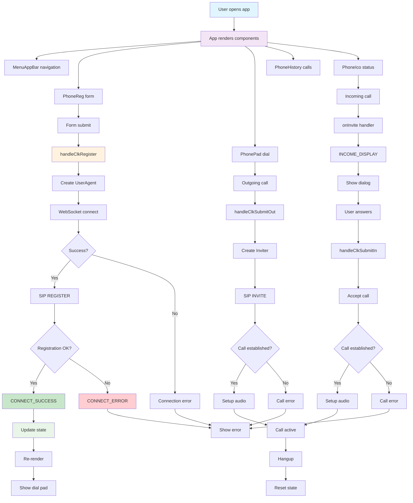
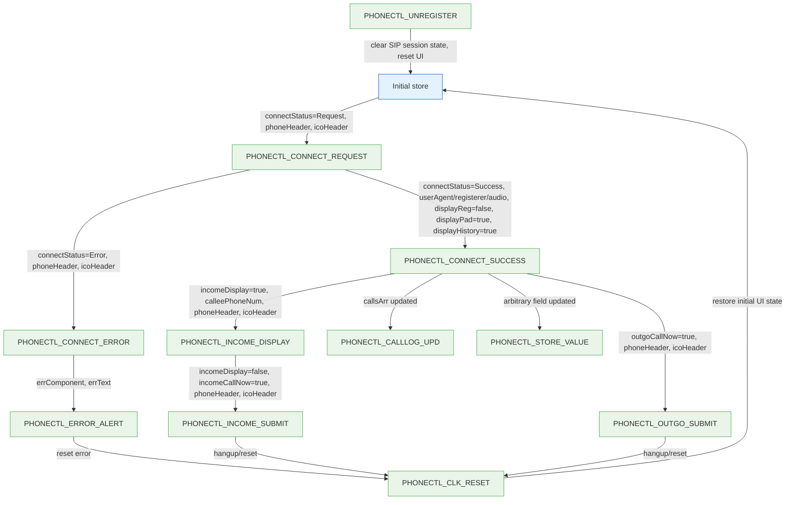

# phone
Готовая сборка в [dist](dist).

## Логика работы приложения

```mermaid
graph TD
    A[User opens app] --> B[App renders components]
    B --> C[MenuAppBar navigation]
    B --> D[PhoneReg form]
    B --> E[PhonePad dial]
    B --> F[PhoneHistory calls]
    B --> G[PhoneIco status]

    D --> H[Form submit]
    H --> I[handleClkRegister]
    I --> J[Create UserAgent]
    J --> K[WebSocket connect]
    K --> L{Success?}
    L -->|Yes| M[SIP REGISTER]
    L -->|No| N[Connection error]

    M --> O{Registration OK?}
    O -->|Yes| P[CONNECT_SUCCESS]
    O -->|No| Q[CONNECT_ERROR]

    P --> R[Update state]
    R --> S[Re-render]
    S --> T[Show dial pad]

    E --> U[Outgoing call]
    U --> V[handleClkSubmitOut]
    V --> W[Create Inviter]
    W --> X[SIP INVITE]

    G --> Y[Incoming call]
    Y --> Z[onInvite handler]
    Z --> AA[INCOME_DISPLAY]
    AA --> BB[Show dialog]

    BB --> CC[User answers]
    CC --> DD[handleClkSubmitIn]
    DD --> EE[Accept call]

    X --> FF{Call established?}
    FF -->|Yes| GG[Setup audio]
    FF -->|No| HH[Call error]

    EE --> II{Call established?}
    II -->|Yes| JJ[Setup audio]
    II -->|No| KK[Call error]

    GG --> LL[Call active]
    JJ --> LL
    LL --> MM[Hangup]
    MM --> NN[Reset state]

    Q --> PP[Show error]
    N --> PP
    HH --> PP
    KK --> PP

    style A fill:#e1f5fe
    style B fill:#f3e5f5
    style I fill:#fff3e0
    style R fill:#e8f5e8
    style P fill:#c8e6c9
    style Q fill:#ffcdd2
```

## Состояние Redux store

```mermaid
flowchart TD
    Init[Initial store]
    CR[PHONECTL_CONNECT_REQUEST]
    CS[PHONECTL_CONNECT_SUCCESS]
    CE[PHONECTL_CONNECT_ERROR]
    UN[PHONECTL_UNREGISTER]
    RS[PHONECTL_CLK_RESET]
    ID[PHONECTL_INCOME_DISPLAY]
    IS[PHONECTL_INCOME_SUBMIT]
    OS[PHONECTL_OUTGO_SUBMIT]
    CL[PHONECTL_CALLLOG_UPD]
    SV[PHONECTL_STORE_VALUE]
    EA[PHONECTL_ERROR_ALERT]

    Init -->|connectStatus=Request, phoneHeader, icoHeader| CR
    CR -->|connectStatus=Success, userAgent/registerer/audio, displayReg=false, displayPad=true, displayHistory=true| CS
    CR -->|connectStatus=Error, phoneHeader, icoHeader| CE
    CS -->|outgoCallNow=true, phoneHeader, icoHeader| OS
    CS -->|incomeDisplay=true, calleePhoneNum, phoneHeader, icoHeader| ID
    ID -->|incomeDisplay=false, incomeCallNow=true, phoneHeader, icoHeader| IS
    CS -->|callsArr updated| CL
    CS -->|arbitrary field updated| SV
    CE -->|errComponent, errText| EA
    EA -->|reset error| RS
    IS -->|hangup/reset| RS
    OS -->|hangup/reset| RS
    RS -->|restore initial UI state| Init
    UN -->|clear SIP session state, reset UI| Init

    classDef action fill:#e8f5e8,stroke:#4caf50,stroke-width:1px
    classDef state fill:#e3f2fd,stroke:#1565c0,stroke-width:1px
    class CR,CS,CE,UN,RS,ID,IS,OS,CL,SV,EA action
    class Init state
```
