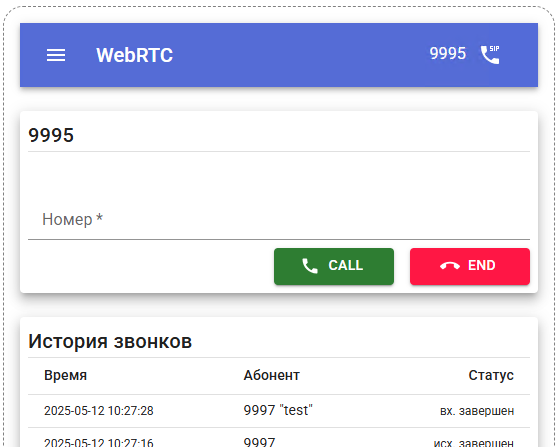

# phone
Готовая сборка в [dist](dist).

Правим под свою АТС блок [index.html](dist/index.html):
```html
<script type="text/javascript">
    window.localStorage.setItem('uas_uri', 'osips.pecom.local')
    window.localStorage.setItem('wss_port', '9443')
</script>
```

